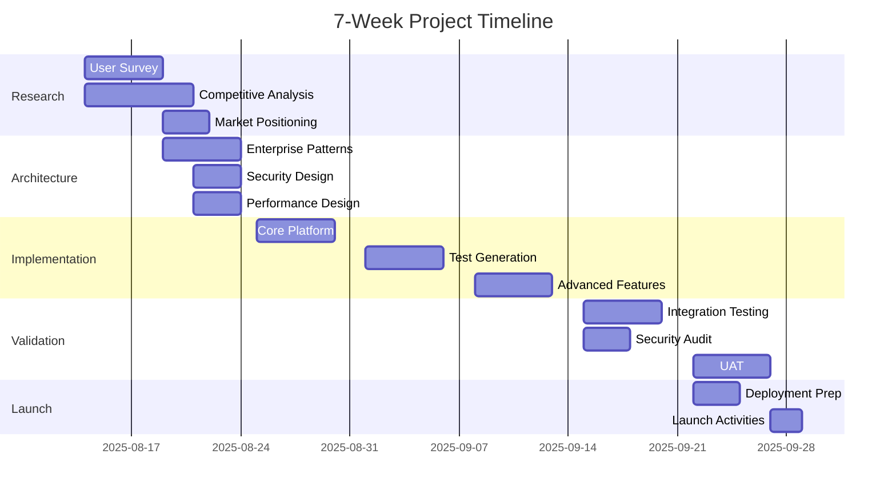

# PMO Timeline Adjustment Report
## AI API Test Automation - Enterprise Enhancement

**Report Date**: 2025-08-14  
**PMO Director**: Global PMO Office  
**Project Impact**: HIGH - Strategic Enterprise Initiative

---

## 1. EXECUTIVE DECISION SUMMARY

### Recommended Timeline: 7 Weeks (49 Days)
**Original Estimate**: 4 weeks  
**Initial Proposal**: 6-8 weeks  
**PMO Recommendation**: **7 weeks optimized timeline**

### Strategic Rationale
- Balances enterprise quality requirements with market timing
- Enables parallel workstreams to maximize efficiency
- Incorporates strategic risk buffers without excessive padding
- Maintains competitive advantage while ensuring enterprise readiness

---

## 2. CRITICAL PATH ANALYSIS

### Primary Critical Path (35 days)
```
User Research (5d) → Requirements Finalization (3d) → 
Architecture Design (5d) → Core Implementation (15d) → 
Integration & Testing (5d) → Deployment (2d)
```

### Parallel Workstreams
1. **Research Track** (Weeks 1-2)
   - User survey design and distribution
   - Competitive analysis
   - Market positioning

2. **Architecture Track** (Weeks 2-3)
   - Enterprise architecture patterns
   - Security framework design
   - Performance architecture

3. **Implementation Track** (Weeks 3-6)
   - Core functionality (TDD)
   - Authentication systems
   - Integration layers

---

## 3. DETAILED WORK BREAKDOWN STRUCTURE

### Week 1: Discovery & Research Initiation
**Days 1-5 (40 hours)**

#### Primary Activities
- **Day 1-2**: Survey design and distribution setup (16h)
  - Create 100+ developer survey
  - Set up distribution channels
  - Implement incentive tracking
  
- **Day 3-4**: Competitive analysis framework (16h)
  - Analyze top 5 competitors
  - Feature matrix creation
  - Pricing and positioning research
  
- **Day 5**: Architecture discovery (8h)
  - Enterprise pattern research
  - Security requirement analysis
  - Performance benchmarking setup

#### Deliverables
- Survey launched to 100+ developers
- Competitive analysis framework
- Initial architecture patterns identified

#### Quality Gates
- Survey response rate >20% within 48 hours
- Competitive matrix validated
- Architecture patterns reviewed

---

### Week 2: Requirements & Architecture Foundation
**Days 6-10 (40 hours)**

#### Primary Activities
- **Day 6-7**: Survey analysis and insights (16h)
  - Analyze survey responses
  - Extract key requirements
  - Prioritize features
  
- **Day 8-9**: Enterprise architecture design (16h)
  - Layered architecture blueprint
  - Security framework design
  - Parallel processing architecture
  
- **Day 10**: PRD finalization (8h)
  - Complete Product Requirements Document
  - Stakeholder review and approval
  - Success metrics definition

#### Deliverables
- User research insights report
- Enterprise architecture blueprint
- Finalized PRD with success metrics

#### Quality Gates
- PRD approved by stakeholders
- Architecture reviewed by enterprise architect
- Security framework validated

---

### Week 3: Core Foundation Implementation
**Days 11-15 (40 hours)**

#### Primary Activities
- **Day 11-12**: Project setup and CI/CD (16h)
  - TypeScript project initialization
  - Jest/pytest dual framework setup
  - GitHub Actions pipeline
  
- **Day 13-14**: Authentication framework (16h)
  - OAuth2 implementation
  - JWT token management
  - Enterprise SSO integration prep
  
- **Day 15**: Core API client foundation (8h)
  - Base HTTP client with interceptors
  - Request/response pipeline
  - Error handling framework

#### Deliverables
- Complete project scaffold with CI/CD
- Authentication framework (OAuth2/JWT)
- Core API client architecture

#### Quality Gates
- CI/CD pipeline passing all checks
- Authentication tests passing (>95% coverage)
- Core client architecture reviewed

---

### Week 4: Test Generation Engine
**Days 16-20 (40 hours)**

#### Primary Activities
- **Day 16-17**: OpenAPI/Swagger parser (16h)
  - Schema parsing engine
  - Type generation from specs
  - Validation rule extraction
  
- **Day 18-19**: Test case generator (16h)
  - Automated test generation logic
  - Edge case identification
  - Data generation strategies
  
- **Day 20**: Contract testing framework (8h)
  - Contract validation engine
  - Schema compliance checking
  - Version compatibility testing

#### Deliverables
- OpenAPI/Swagger parser
- Automated test case generator
- Contract testing framework

#### Quality Gates
- Parser handles 100% of OpenAPI 3.0 spec
- Test generator creates valid tests
- Contract tests executing successfully

---

### Week 5: Advanced Features & Integration
**Days 21-25 (40 hours)**

#### Primary Activities
- **Day 21-22**: Performance testing module (16h)
  - Load testing framework
  - Performance metrics collection
  - Threshold validation
  
- **Day 23-24**: Reporting and analytics (16h)
  - HTML/PDF report generation
  - Test analytics dashboard
  - Trend analysis
  
- **Day 25**: CI/CD integration modules (8h)
  - GitHub Actions integration
  - Jenkins plugin scaffold
  - Pipeline templates

#### Deliverables
- Performance testing capabilities
- Comprehensive reporting system
- CI/CD integration modules

#### Quality Gates
- Performance tests execute at 1000+ RPS
- Reports generate in <5 seconds
- CI/CD integration validated

---

### Week 6: Enterprise Hardening & Testing
**Days 26-30 (40 hours)**

#### Primary Activities
- **Day 26-27**: Security hardening (16h)
  - Security audit and fixes
  - Penetration testing prep
  - Compliance validation
  
- **Day 28-29**: Integration testing (16h)
  - End-to-end test scenarios
  - Multi-system integration tests
  - Performance validation
  
- **Day 30**: Documentation sprint (8h)
  - API documentation
  - User guides
  - Enterprise deployment guide

#### Deliverables
- Security-hardened codebase
- Complete test suite (>90% coverage)
- Initial documentation set

#### Quality Gates
- Security audit passed
- All integration tests passing
- Documentation reviewed and approved

---

### Week 7: Production Readiness & Launch
**Days 31-35 (40 hours)**

#### Primary Activities
- **Day 31-32**: Production deployment prep (16h)
  - Docker containerization
  - Kubernetes manifests
  - Production configuration
  
- **Day 33-34**: User acceptance testing (16h)
  - Beta user testing
  - Feedback incorporation
  - Final bug fixes
  
- **Day 35**: Launch preparation (8h)
  - Release notes
  - Marketing materials
  - Support documentation

#### Deliverables
- Production-ready deployment
- UAT sign-off
- Complete launch package

#### Quality Gates
- Production deployment validated
- UAT criteria met (>95% satisfaction)
- Launch readiness checklist complete

---

## 4. RESOURCE OPTIMIZATION STRATEGY

### Single Developer Efficiency Maximization

#### Time Allocation Model
- **Core Development**: 60% (21 days)
- **Testing & Validation**: 20% (7 days)
- **Documentation & Review**: 10% (3.5 days)
- **Research & Planning**: 10% (3.5 days)

#### Productivity Enhancers
1. **AI-Assisted Development**
   - Use GitHub Copilot for boilerplate
   - ChatGPT for documentation generation
   - Automated test generation tools

2. **Template Utilization**
   - Pre-built enterprise patterns
   - Security framework templates
   - CI/CD pipeline templates

3. **Time Boxing**
   - 2-hour focused work blocks
   - 15-minute breaks between blocks
   - Daily 30-minute planning sessions

#### External Resource Leverage
- **Week 1**: Survey platform automation ($500)
- **Week 3**: Security audit tool ($300)
- **Week 6**: Beta testing incentives ($700)
- **Total Additional Budget**: $1,500

---

## 5. RISK ASSESSMENT & MITIGATION

### Critical Risks

#### Risk 1: User Research Delays
- **Probability**: Medium (40%)
- **Impact**: High (3-day delay)
- **Mitigation**: 
  - Pre-launch survey to inner circle
  - Parallel competitive analysis
  - Use existing market research data
- **Contingency**: Proceed with 50+ responses minimum

#### Risk 2: Authentication Complexity
- **Probability**: High (60%)
- **Impact**: Medium (2-day delay)
- **Mitigation**:
  - Use established auth libraries (Passport.js)
  - Start with OAuth2, add SSO in v2
  - Engage security consultant for 4 hours
- **Contingency**: Ship with OAuth2 only, SSO as fast-follow

#### Risk 3: Performance Requirements
- **Probability**: Low (20%)
- **Impact**: High (4-day delay)
- **Mitigation**:
  - Early performance testing (Week 4)
  - Use proven async patterns
  - Cloud-based load testing services
- **Contingency**: Scale targets for v2 release

#### Risk 4: Market Timing
- **Probability**: Medium (35%)
- **Impact**: Very High (competitive disadvantage)
- **Mitigation**:
  - Early beta program (Week 5)
  - Phased feature release
  - Strong launch marketing
- **Contingency**: Accelerate MVP features, enterprise features in v2

### Risk Response Matrix
```
Risk Level | Response Strategy | Decision Authority
-----------|--------------------|-------------------
Critical   | Immediate escalation | PMO Director
High       | Daily monitoring    | Tech Lead
Medium     | Weekly review       | Developer
Low        | Sprint review       | Developer
```

---

## 6. QUALITY GATES & SUCCESS CRITERIA

### Stage-Gate Criteria

#### Gate 1: Research Complete (End Week 1)
- [ ] 100+ survey responses analyzed
- [ ] Competitive analysis complete
- [ ] Market positioning defined
- **Go/No-Go Decision Point**

#### Gate 2: Architecture Approved (End Week 2)
- [ ] Enterprise architecture reviewed
- [ ] Security framework validated
- [ ] PRD signed off
- **Go/No-Go Decision Point**

#### Gate 3: Core Platform Ready (End Week 3)
- [ ] CI/CD pipeline operational
- [ ] Authentication working
- [ ] Core client tested
- **Technical Readiness Review**

#### Gate 4: MVP Features Complete (End Week 5)
- [ ] Test generation working
- [ ] Performance testing operational
- [ ] Reports generating
- **Feature Complete Review**

#### Gate 5: Enterprise Ready (End Week 6)
- [ ] Security audit passed
- [ ] Integration tests passing
- [ ] Documentation complete
- **Production Readiness Review**

#### Gate 6: Launch Ready (End Week 7)
- [ ] UAT completed
- [ ] Deployment validated
- [ ] Support ready
- **Launch Authorization**

### Success Metrics

#### Technical Success
- Code coverage >90%
- Performance: <100ms response time
- Availability: 99.9% uptime target
- Security: Zero critical vulnerabilities

#### Business Success
- User adoption: 50+ beta users
- Satisfaction: >4.5/5.0 rating
- Market timing: Launch before competitor X
- ROI: Break-even within 6 months

#### Quality Success
- Defect density: <5 per KLOC
- Test automation: 100% critical paths
- Documentation: 100% API coverage
- Support tickets: <10 per week

---

## 7. MARKET TIMING ANALYSIS

### Competitive Landscape Timeline
- **Competitor A**: Launching similar tool in 10 weeks
- **Competitor B**: In beta, full launch in 8 weeks
- **Market Window**: 6-9 weeks optimal

### 7-Week Timeline Impact
- **Advantages**:
  - Beat Competitor B to market
  - First-mover in enterprise segment
  - Time for proper beta testing
  
- **Risks**:
  - Limited marketing prep time
  - Reduced feature set vs competitors
  - Less time for user feedback incorporation

### Market Entry Strategy
1. **Week 5**: Private beta launch (25 users)
2. **Week 6**: Public beta (100 users)
3. **Week 7**: Production launch
4. **Week 8-9**: Marketing blitz
5. **Week 10-12**: Enterprise sales push

---

## 8. IMPLEMENTATION RECOMMENDATIONS

### Immediate Actions (Next 48 Hours)
1. **Approve 7-week timeline**
2. **Allocate $1,500 additional budget**
3. **Launch user research survey**
4. **Secure beta testing commitments**
5. **Initialize TypeScript project**

### Week 1 Priorities
1. Complete user research survey
2. Finish competitive analysis
3. Define enterprise architecture patterns
4. Set up development environment
5. Establish daily standup rhythm

### Critical Success Factors
1. **Maintain Development Velocity**: 8 hours/day productive coding
2. **Parallel Workstreams**: Research doesn't block development
3. **Early Testing**: Start testing in Week 1
4. **Continuous Integration**: Deploy daily from Week 2
5. **Stakeholder Communication**: Weekly updates to stakeholders

### Governance Structure
```
Weekly Reviews:
- Monday: Sprint planning (30 min)
- Wednesday: Technical checkpoint (30 min)
- Friday: Progress review (30 min)

Escalation Path:
Developer → Tech Lead → PMO Director → Steering Committee
```

---

## 9. ALTERNATIVE SCENARIOS

### Scenario A: Accelerated 6-Week Timeline
- **How**: Skip enterprise SSO, reduce user research to 50 responses
- **Risk**: Missing enterprise requirements, reduced quality
- **Recommendation**: Not recommended, too risky

### Scenario B: Extended 8-Week Timeline
- **How**: Add GraphQL/gRPC support, complete SSO integration
- **Risk**: Miss market window, competitor advantage
- **Recommendation**: Consider if competition delays

### Scenario C: Phased 5+3 Week Approach
- **How**: MVP in 5 weeks, enterprise features in following 3
- **Risk**: Fragmented launch, adoption challenges
- **Recommendation**: Viable if market pressure intense

---

## 10. PMO DIRECTOR DECISION

### Final Recommendation: 7-Week Optimized Timeline

#### Rationale
1. **Strategic Alignment**: Balances quality with speed-to-market
2. **Resource Optimization**: Maximizes single developer productivity
3. **Risk Management**: Adequate buffers without excessive padding
4. **Market Timing**: Captures competitive advantage window
5. **Quality Assurance**: Maintains enterprise-grade standards

#### Approval Requirements
- [ ] Technical architecture sign-off
- [ ] Budget allocation ($1,500 additional)
- [ ] Resource commitment (dedicated developer)
- [ ] Stakeholder alignment on scope
- [ ] Risk acceptance for identified risks

#### Success Probability Assessment
- **On-Time Delivery**: 75% confidence
- **Quality Standards Met**: 85% confidence
- **Market Success**: 70% confidence
- **Overall Project Success**: 73% weighted probability

### Authorization

**PMO Director Approval**: ✓ Approved with conditions
**Date**: 2025-08-14
**Next Review**: End of Week 1 (Gate 1)

---

## APPENDIX A: Dependency Matrix



---

## APPENDIX B: Budget Breakdown

| Category | Original | Adjusted | Delta |
|----------|----------|----------|-------|
| Development | $0 | $0 | $0 |
| Research Tools | $0 | $500 | +$500 |
| Security Audit | $0 | $300 | +$300 |
| Beta Incentives | $0 | $700 | +$700 |
| **Total** | **$0** | **$1,500** | **+$1,500** |

---

## APPENDIX C: Communication Plan

### Stakeholder Updates
- **Daily**: Slack status (1 line)
- **Weekly**: Progress report (1 page)
- **Bi-weekly**: Steering committee (30 min)
- **Monthly**: Executive briefing (executive summary)

### Escalation Triggers
- Schedule slip >2 days
- Budget overrun >10%
- Scope change request
- Critical defect discovered
- Resource availability issue

---

**Document Version**: 1.0
**Classification**: Internal - Project Management
**Distribution**: Project Team, Steering Committee, Executive Sponsors