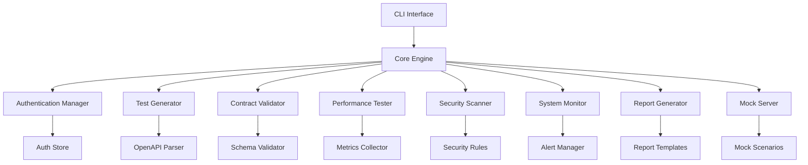

# 🚀 AI API Test Automation Framework

**Enterprise-Grade API Testing Solution with Automated Test Generation**

[](https://www.typescriptlang.org/)
[](https://nodejs.org/)
[](https://spec.openapis.org/)
[](https://www.docker.com/)

## 📋 Table of Contents

- [🎯 Overview](#-overview)
- [✨ Features](#-features)
- [🚀 Quick Start](#-quick-start)
- [📖 Documentation](#-documentation)
- [🏗️ Architecture](#️-architecture)
- [🧪 Testing](#-testing)
- [🤝 Contributing](#-contributing)
- [📄 License](#-license)

## 🎯 Overview

The AI API Test Automation Framework is a comprehensive, enterprise-grade solution for automated API testing. Built with TypeScript and Node.js, it provides intelligent test generation, contract validation, performance testing, security scanning, and comprehensive reporting capabilities.

### 🌟 Key Highlights

- **🤖 Intelligent Test Generation**: Automatically generates comprehensive test suites from OpenAPI specifications
- **🔐 Enterprise Security**: Built-in security scanning with OWASP Top 10 compliance
- **⚡ Performance Testing**: Load testing with real-time metrics and threshold validation
- **📊 Advanced Reporting**: Multi-format reports with charts, metrics, and detailed analysis
- **🌍 Multi-Environment**: Support for staging, production, and custom environments
- **🔄 CI/CD Integration**: Ready-to-use pipeline configurations for GitHub Actions, GitLab CI, Jenkins
- **📈 Real-time Monitoring**: System monitoring with alerting and health checks
- **🎭 Mock Servers**: Dynamic mock server generation for isolated testing

## ✨ Features

### 🧪 Test Generation & Execution
- **Automated Test Generation**: Create comprehensive test suites from OpenAPI specs
- **Contract Validation**: Ensure API responses match OpenAPI schemas
- **Negative Testing**: Automatically generate edge cases and error scenarios
- **Boundary Testing**: Test parameter limits and data validation
- **Authentication Support**: OAuth2, JWT, API Keys, and custom auth methods

### 🔒 Security & Compliance
- **Security Scanning**: OWASP Top 10, injection attacks, authentication bypass
- **Vulnerability Assessment**: Critical, high, medium, and low severity classification
- **Compliance Reporting**: SARIF format support for security tools integration
- **Custom Security Rules**: Extensible rule engine for organization-specific checks

### ⚡ Performance & Reliability
- **Load Testing**: Configurable concurrency and duration
- **Stress Testing**: Find breaking points and performance limits
- **Real-time Metrics**: Response times, throughput, error rates
- **Threshold Validation**: Automated pass/fail criteria
- **Performance Regression**: Compare results across test runs

### 📊 Monitoring & Observability
- **System Monitoring**: CPU, memory, disk usage tracking
- **Error Tracking**: Comprehensive error logging and classification
- **Health Checks**: Multi-component health status monitoring
- **Alerting**: Configurable thresholds with webhook notifications
- **Metrics Collection**: Time-series data with retention policies

### 🔄 Integration & Automation
- **CI/CD Pipelines**: Pre-built configurations for popular platforms
- **Mock Servers**: Dynamic server generation with scenario support
- **Multi-format Reporting**: HTML, JSON, JUnit, Markdown, SARIF
- **Environment Management**: Staging, production, development configurations
- **Integration Testing**: End-to-end workflow validation

## 🚀 Quick Start

### Prerequisites

- **Node.js** 18.0.0 or higher
- **npm** 8.0.0 or higher
- **OpenAPI Specification** (v3.0+)

### Installation

```bash
# Clone the repository
git clone https://github.com/your-org/ai-api-test-automation.git
cd ai-api-test-automation

# Install dependencies
npm install

# Build the project
npm run build
```

### Basic Usage

1. **Generate tests from your OpenAPI spec:**

```bash
npm run cli generate tests --spec ./openapi.yml --output ./tests
```

2. **Run functional tests:**

```bash
npm run cli test functional --spec ./openapi.yml --environment staging
```

3. **Perform security scan:**

```bash
npm run cli security scan --spec ./openapi.yml --output ./security-reports
```

4. **Run performance tests:**

```bash
npm run cli performance run --spec ./openapi.yml --concurrency 10 --duration 60
```

5. **Generate comprehensive report:**

```bash
npm run cli report generate --input ./test-results --format html
```

### 30-Second Demo

```bash
# Quick demonstration with sample API
npm run demo
```

## 📖 Documentation

### 📚 User Guides
- [**Getting Started**](./docs/user-guide/getting-started.md) - First steps and basic concepts
- [**Test Generation**](./docs/user-guide/test-generation.md) - Creating and customizing tests
- [**Authentication Setup**](./docs/user-guide/authentication.md) - Configuring API authentication
- [**Performance Testing**](./docs/user-guide/performance-testing.md) - Load and stress testing
- [**Security Scanning**](./docs/user-guide/security-scanning.md) - Vulnerability assessment
- [**Reporting & Analytics**](./docs/user-guide/reporting.md) - Understanding test results

### 🔧 Developer Resources
- [**API Reference**](./docs/api/README.md) - Complete API documentation
- [**Architecture Guide**](./docs/developer/architecture.md) - System design and components
- [**Plugin Development**](./docs/developer/plugins.md) - Creating custom extensions
- [**Contributing Guide**](./docs/developer/contributing.md) - Development guidelines
- [**Testing Strategy**](./docs/developer/testing.md) - Framework testing approach

### 🛠️ Operations & Deployment
- [**Installation Guide**](./docs/operations/installation.md) - Detailed setup instructions
- [**Configuration Reference**](./docs/operations/configuration.md) - All configuration options
- [**CI/CD Integration**](./docs/operations/cicd.md) - Pipeline setup and automation
- [**Monitoring & Alerting**](./docs/operations/monitoring.md) - Production monitoring
- [**Troubleshooting**](./docs/operations/troubleshooting.md) - Common issues and solutions

### 📝 Examples & Tutorials
- [**Quick Start Examples**](./examples/quick-start/) - Ready-to-run examples
- [**Integration Patterns**](./examples/integrations/) - Common integration scenarios
- [**CI/CD Templates**](./examples/cicd/) - Pipeline configurations
- [**Custom Plugins**](./examples/plugins/) - Plugin development examples

## 🏗️ Architecture

### Component Overview



### Technology Stack

- **Runtime**: Node.js 18+ with TypeScript
- **Testing**: Jest with comprehensive test coverage
- **Documentation**: Markdown with automated generation
- **CI/CD**: GitHub Actions, GitLab CI, Jenkins support
- **Monitoring**: Built-in metrics collection and alerting
- **Security**: OWASP compliance with custom rule engine

## 🧪 Testing

The framework includes comprehensive testing at multiple levels:

### Unit Tests
```bash
npm test                    # Run all tests
npm run test:unit          # Unit tests only
npm run test:coverage      # Coverage report
```

### Integration Tests
```bash
npm run test:integration   # End-to-end integration tests
npm run test:e2e          # Full system tests
```

### Security Tests
```bash
npm run test:security     # Security vulnerability tests
npm run test:compliance   # OWASP compliance tests
```

### Performance Tests
```bash
npm run test:performance  # Performance regression tests
npm run test:load         # Load testing validation
```

## 🤝 Contributing

We welcome contributions! Please see our [Contributing Guide](./docs/developer/contributing.md) for details.

### Development Setup

```bash
# Fork and clone the repository
git clone https://github.com/your-username/ai-api-test-automation.git
cd ai-api-test-automation

# Install dependencies
npm install

# Start development mode
npm run dev

# Run tests
npm test

# Lint and format
npm run lint
npm run format
```

### Code Standards

- **TypeScript**: Strict mode with comprehensive type coverage
- **Testing**: Minimum 90% code coverage required
- **Documentation**: All public APIs must be documented
- **Security**: Security-first development practices

## 📄 License

This project is licensed under the MIT License - see the [LICENSE](LICENSE) file for details.

## 🆘 Support

- **Documentation**: [docs.example.com](https://docs.example.com)
- **Issues**: [GitHub Issues](https://github.com/your-org/ai-api-test-automation/issues)
- **Discussions**: [GitHub Discussions](https://github.com/your-org/ai-api-test-automation/discussions)
- **Email**: support@yourorg.com

## 🏆 Enterprise Features

For enterprise customers, we offer:

- **Professional Support**: 24/7 technical support
- **Custom Integrations**: Tailored solutions for your infrastructure
- **Training & Consulting**: Expert guidance and best practices
- **Enterprise Security**: Enhanced security features and compliance
- **Performance Optimization**: Custom performance tuning

Contact us at enterprise@yourorg.com for more information.

---

**Built with ❤️ by the API Testing Team**

*Making API testing intelligent, comprehensive, and effortless.*