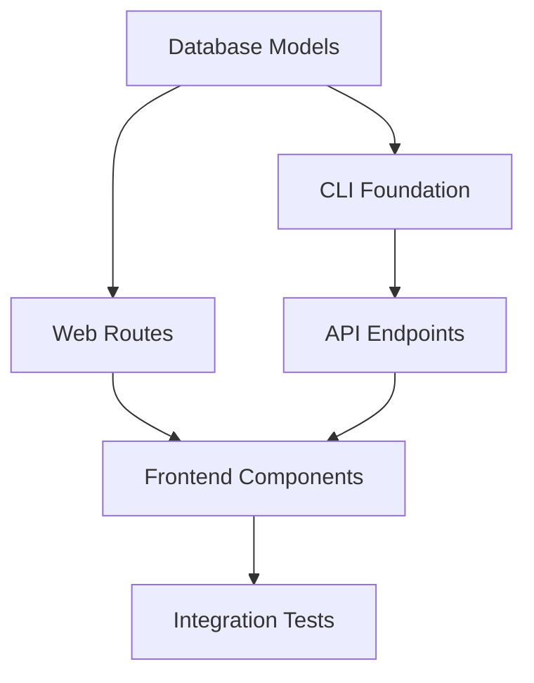
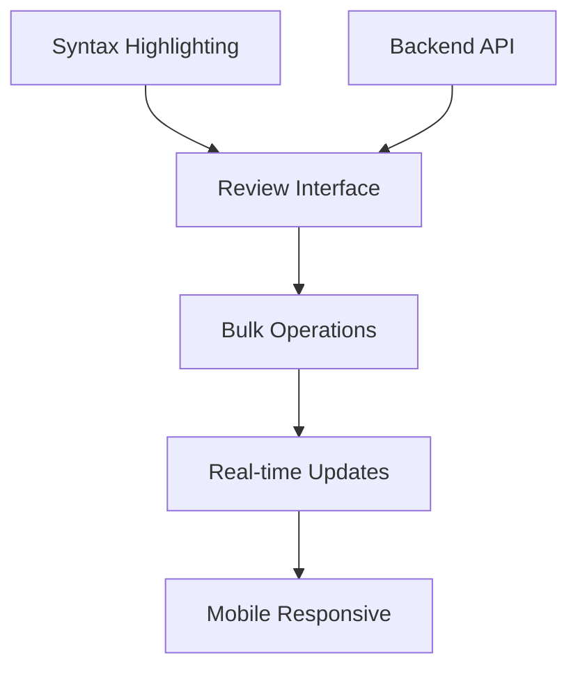
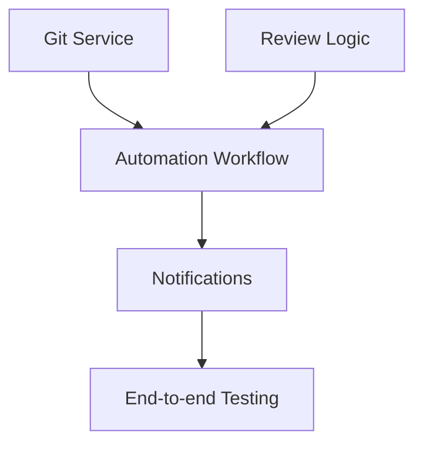

# Agent Coordination Matrix
## AI API Test Automation - QA Review Workflow Implementation

**PMO Control Document**  
**Version**: 1.0  
**Date**: September 1, 2025  
**Classification**: Project Coordination  

---

## 📊 AGENT ALLOCATION MATRIX

### **Resource Allocation Summary**
| Agent Role | Days 1-2 | Days 3-4 | Days 5-6 | Days 7-8 | Days 9-10 | Total Effort |
|------------|----------|----------|----------|----------|-----------|--------------|
| Backend Developer | 100% | 100% | 100% | 80% | 60% | 86% avg |
| Frontend Developer | 60% | 100% | 100% | 80% | 40% | 76% avg |
| Testing/QA Agent | 80% | 80% | 100% | 100% | 100% | 92% avg |
| DevOps Agent | 20% | 20% | 60% | 80% | 100% | 56% avg |

---

## 🔄 DAILY COORDINATION WORKFLOWS

### **DAY 1: FOUNDATION ESTABLISHMENT**

#### **Backend Developer Agent (100% allocation)**
```python
# Morning Sprint (0800-1200)
TASKS = [
    "implement_review_workflow_models()",
    "create_database_migrations()",
    "setup_review_state_machine()",
    "create_unit_tests_for_models()"
]

# Afternoon Sprint (1300-1700)  
TASKS = [
    "implement_cli_foundation()",
    "create_basic_commands()",
    "setup_click_interface()",
    "integration_tests_cli()"
]

# Handoffs Required
DEPENDENCIES = {
    "to_frontend": "review_models_schema",
    "to_testing": "unit_test_framework",
    "from_devops": "database_environment"
}
```

#### **Frontend Developer Agent (60% allocation)**
```python
# Morning Sprint (0800-1200)
TASKS = [
    "setup_fastapi_routes_structure()",
    "create_html_template_foundation()",
    "implement_basic_dashboard_layout()"
]

# Afternoon Sprint (1300-1700)
TASKS = [
    "integrate_htmx_framework()",
    "create_responsive_grid_system()",
    "implement_basic_navigation()"
]

# Dependencies
DEPENDENCIES = {
    "from_backend": "review_models_api",
    "to_testing": "ui_component_tests"
}
```

#### **Testing/QA Agent (80% allocation)**
```python
# Full Day Sprint (0800-1700)
TASKS = [
    "setup_test_database_fixtures()",
    "create_review_model_tests()",
    "implement_cli_command_tests()",
    "establish_testing_patterns()",
    "create_integration_test_framework()"
]

# Quality Gates
GATES = [
    "test_coverage_85_percent",
    "all_unit_tests_passing",
    "tdd_methodology_compliance"
]
```

#### **DevOps Agent (20% allocation)**
```python
# Part-time Tasks (2-3 hours)
TASKS = [
    "setup_development_database()",
    "configure_testing_environment()",
    "prepare_ci_pipeline_foundation()"
]
```

### **DAY 2: CORE FUNCTIONALITY**

#### **Backend Developer Agent (100% allocation)**
```python
# Morning Sprint (0800-1200)
TASKS = [
    "implement_review_assignment_logic()",
    "create_comment_system_backend()",
    "setup_file_organization_service()",
    "implement_review_status_tracking()"
]

# Afternoon Sprint (1300-1700)
TASKS = [
    "create_web_api_endpoints()",
    "implement_authentication_middleware()",
    "setup_session_management()",
    "create_api_integration_tests()"
]

# Critical Handoffs
HANDOFFS = {
    "morning_completion": "review_assignment_api",
    "afternoon_completion": "web_routes_specification"
}
```

#### **Frontend Developer Agent (100% allocation)**
```python
# Morning Sprint (0800-1200)
TASKS = [
    "implement_review_dashboard_ui()",
    "create_review_list_components()",
    "setup_review_card_layout()",
    "implement_status_indicators()"
]

# Afternoon Sprint (1300-1700)
TASKS = [
    "integrate_backend_api_calls()",
    "implement_real_time_updates()",
    "create_comment_ui_components()",
    "setup_form_validation()"
]

# Integration Points
INTEGRATIONS = {
    "backend_api": "requires_afternoon_backend_completion",
    "real_time": "htmx_websocket_setup"
}
```

### **DAYS 3-4: ADVANCED INTERFACE DEVELOPMENT**

#### **Multi-Agent Coordination Pattern**
```python
# Daily Standup Protocol (0900-0915)
AGENDA = [
    "yesterday_completions_review()",
    "today_dependencies_clarification()",
    "blocker_identification_resolution()",
    "handoff_scheduling()"
]

# Mid-day Sync (1230-1245)
SYNC_POINTS = [
    "morning_sprint_completion_check()",
    "afternoon_priorities_alignment()",
    "integration_point_validation()"
]

# End-of-day Handoff (1700-1715)
HANDOFF_PROTOCOL = [
    "completed_work_demonstration()",
    "next_day_dependencies_review()",
    "code_merge_coordination()",
    "testing_requirement_handoff()"
]
```

### **DAYS 5-6: CRITICAL INTEGRATION PHASE**

#### **High-Coordination Period Protocol**
```python
# Enhanced Communication Rhythm
COMMUNICATION_FREQUENCY = {
    "standups": "twice_daily_0900_1400",
    "integration_checks": "every_2_hours",
    "blocker_escalation": "immediate_15_min_response",
    "code_reviews": "within_1_hour_of_pr"
}

# Git Integration Coordination
GIT_WORKFLOW = {
    "backend_agent": "git_service_implementation",
    "testing_agent": "git_integration_validation", 
    "devops_agent": "ci_cd_git_hooks_setup",
    "frontend_agent": "git_status_ui_components"
}
```

---

## 🎯 DEPENDENCY MANAGEMENT

### **Critical Path Dependencies**

#### **Day 1-2 Dependencies**


#### **Day 3-4 Dependencies**


#### **Day 5-6 Dependencies**


### **Dependency Risk Mitigation**
```python
# Dependency Failure Protocol
class DependencyRiskMitigation:
    def handle_blocked_dependency(self, dependency_id, blocking_agent):
        # 1. Immediate escalation to PMO
        self.escalate_to_pmo(dependency_id, "BLOCKER")
        
        # 2. Activate fallback work streams
        fallback_tasks = self.get_fallback_tasks(dependency_id)
        self.reassign_agent_capacity(fallback_tasks)
        
        # 3. Parallel problem resolution
        self.create_unblocking_task_force(blocking_agent)
        
        # 4. Timeline impact assessment
        timeline_impact = self.assess_timeline_impact(dependency_id)
        self.notify_stakeholders(timeline_impact)
```

---

## 📋 HANDOFF PROCEDURES

### **Code Handoff Protocol**

#### **Backend → Frontend Handoff**
```python
# Required Deliverables
BACKEND_TO_FRONTEND = {
    "api_specification": "openapi_3.0_compliant",
    "endpoint_documentation": "with_example_requests_responses",
    "authentication_details": "session_management_specs",
    "error_handling": "standardized_error_responses",
    "data_models": "json_schema_definitions"
}

# Handoff Validation
VALIDATION_STEPS = [
    "api_endpoints_accessible_from_frontend",
    "authentication_flow_working",
    "error_responses_properly_formatted",
    "data_models_match_frontend_expectations"
]
```

#### **Frontend → Testing Handoff**
```python
# UI Testing Requirements
FRONTEND_TO_TESTING = {
    "component_test_ids": "data_testid_attributes",
    "user_flow_documentation": "step_by_step_user_journeys",
    "accessibility_compliance": "aria_labels_and_roles",
    "responsive_breakpoints": "mobile_tablet_desktop_specs",
    "performance_requirements": "load_time_expectations"
}
```

#### **Testing → DevOps Handoff**
```python
# Deployment Readiness
TESTING_TO_DEVOPS = {
    "test_suite_status": "all_tests_passing_with_coverage",
    "performance_validation": "load_testing_results",
    "security_scan_results": "vulnerability_assessment_clean",
    "integration_test_status": "end_to_end_workflows_validated",
    "deployment_checklist": "production_readiness_confirmed"
}
```

### **Quality Gate Handoff Matrix**

| From Agent | To Agent | Deliverable | Quality Gate | Validation Method |
|------------|----------|-------------|--------------|-------------------|
| Backend | Frontend | API Endpoints | Response <2s | Automated API tests |
| Backend | Testing | Unit Tests | Coverage >85% | Coverage report |
| Frontend | Testing | UI Components | Accessibility AA | Automated a11y scan |
| Testing | DevOps | Test Suite | 100% passing | CI pipeline validation |
| DevOps | All | Environment | Health checks passing | Monitoring dashboard |

---

## ⚡ BLOCKER ESCALATION MATRIX

### **Escalation Timeline**

#### **Level 1: Agent-to-Agent (0-2 hours)**
```python
# Direct coordination for immediate issues
SCENARIOS = [
    "api_endpoint_specification_clarification",
    "ui_component_behavior_questions", 
    "test_data_requirements",
    "integration_point_coordination"
]

RESOLUTION_METHODS = [
    "direct_communication_slack_call",
    "screen_sharing_code_review",
    "pair_programming_session",
    "documentation_clarification"
]
```

#### **Level 2: PMO Intervention (2-4 hours)**
```python
# PMO intervention for coordination failures
SCENARIOS = [
    "dependency_blocking_critical_path",
    "resource_allocation_conflicts",
    "technical_approach_disagreements",
    "quality_gate_failures"
]

PMO_ACTIONS = [
    "resource_reallocation",
    "technical_decision_arbitration", 
    "timeline_adjustment",
    "stakeholder_communication"
]
```

#### **Level 3: Stakeholder Escalation (4-8 hours)**
```python
# Executive intervention for major issues
SCENARIOS = [
    "timeline_jeopardy_beyond_recovery",
    "technical_feasibility_concerns",
    "resource_unavailability",
    "scope_change_requirements"
]

STAKEHOLDER_ACTIONS = [
    "executive_decision_on_scope_reduction",
    "additional_resource_authorization",
    "timeline_extension_approval",
    "risk_acceptance_decisions"
]
```

### **Blocker Prevention Protocol**
```python
# Proactive Blocker Prevention
class BlockerPrevention:
    def daily_dependency_health_check(self):
        # Check all upcoming dependencies
        upcoming_deps = self.get_next_24h_dependencies()
        
        for dep in upcoming_deps:
            readiness = self.assess_dependency_readiness(dep)
            if readiness < 80:
                self.create_unblocking_task(dep)
                self.notify_involved_agents(dep)
    
    def create_parallel_work_streams(self):
        # Always have backup tasks ready
        for agent in self.agents:
            primary_tasks = agent.get_current_tasks()
            backup_tasks = self.generate_backup_tasks(primary_tasks)
            agent.assign_backup_work(backup_tasks)
```

---

## 🔧 TECHNICAL INTEGRATION POINTS

### **Database Integration Coordination**
```python
# Database Schema Coordination
class DatabaseCoordination:
    def coordinate_schema_changes(self, agent_requests):
        # Consolidate all schema change requests
        consolidated_changes = self.merge_schema_requests(agent_requests)
        
        # Create single migration script
        migration = self.create_consolidated_migration(consolidated_changes)
        
        # Validate with all agents
        for agent in self.agents:
            validation_result = agent.validate_schema_changes(migration)
            if not validation_result.valid:
                self.resolve_schema_conflict(agent, validation_result)
        
        # Execute coordinated deployment
        self.deploy_schema_changes(migration)
```

### **API Integration Coordination**
```python
# API Contract Management
class APICoordination:
    def manage_api_contracts(self):
        # Generate OpenAPI specification from backend
        api_spec = self.backend_agent.generate_openapi_spec()
        
        # Validate with frontend requirements
        frontend_validation = self.frontend_agent.validate_api_spec(api_spec)
        
        # Validate with testing requirements  
        testing_validation = self.testing_agent.validate_api_spec(api_spec)
        
        # Resolve any conflicts
        if not frontend_validation.valid or not testing_validation.valid:
            resolved_spec = self.resolve_api_conflicts(
                api_spec, frontend_validation, testing_validation
            )
            return resolved_spec
        
        return api_spec
```

---

## 📊 SUCCESS METRICS BY AGENT

### **Backend Developer Agent Metrics**
```python
BACKEND_SUCCESS_METRICS = {
    "api_response_time": "<2_seconds_99th_percentile",
    "database_query_performance": "<100ms_average", 
    "code_coverage": ">90_percent",
    "api_uptime": "99.9_percent_during_testing",
    "integration_test_pass_rate": "100_percent"
}

DAILY_TRACKING = {
    "endpoints_implemented": "count_per_day",
    "unit_tests_written": "count_and_coverage",
    "bugs_fixed": "count_and_severity",
    "performance_optimizations": "measurable_improvements"
}
```

### **Frontend Developer Agent Metrics**
```python
FRONTEND_SUCCESS_METRICS = {
    "page_load_time": "<3_seconds_initial_load",
    "ui_responsiveness": "<100ms_interaction_response",
    "accessibility_compliance": "WCAG_2.1_AA_level", 
    "browser_compatibility": "chrome_firefox_safari_edge",
    "mobile_responsiveness": "320px_to_1920px_range"
}

USER_EXPERIENCE_TRACKING = {
    "review_workflow_completion_time": "<15_minutes_target",
    "user_error_rate": "<5_percent_common_operations",
    "ui_component_reliability": "99_percent_functional"
}
```

### **Testing/QA Agent Metrics**
```python
TESTING_SUCCESS_METRICS = {
    "test_coverage": ">90_percent_line_coverage",
    "test_execution_speed": "<5_minutes_full_suite",
    "bug_detection_rate": ">95_percent_critical_bugs",
    "false_positive_rate": "<5_percent_test_failures",
    "integration_test_reliability": "99_percent_consistent_results"
}

QUALITY_ASSURANCE_TRACKING = {
    "defects_found_per_day": "count_and_severity_classification",
    "test_automation_coverage": "percentage_automated_vs_manual",
    "regression_prevention": "count_prevented_regressions"
}
```

### **DevOps Agent Metrics**
```python
DEVOPS_SUCCESS_METRICS = {
    "deployment_success_rate": "100_percent_staging_production",
    "ci_cd_pipeline_speed": "<10_minutes_full_pipeline",
    "infrastructure_uptime": "99.9_percent_availability",
    "monitoring_coverage": "100_percent_critical_components",
    "backup_recovery_time": "<1_hour_full_recovery"
}

OPERATIONAL_TRACKING = {
    "deployment_frequency": "automated_per_merge",
    "incident_response_time": "<15_minutes_acknowledgment",
    "system_performance_monitoring": "real_time_dashboards"
}
```

---

## 🎯 COORDINATION SUCCESS VALIDATION

### **Daily Coordination Health Check**
```python
class CoordinationHealthCheck:
    def assess_daily_coordination_health(self):
        health_score = 0
        
        # Agent sync status (25 points)
        sync_score = self.check_agent_synchronization()
        health_score += min(sync_score, 25)
        
        # Dependency resolution (25 points)  
        dependency_score = self.check_dependency_health()
        health_score += min(dependency_score, 25)
        
        # Communication effectiveness (25 points)
        communication_score = self.assess_communication_quality()
        health_score += min(communication_score, 25)
        
        # Progress alignment (25 points)
        progress_score = self.check_progress_alignment()
        health_score += min(progress_score, 25)
        
        return {
            "overall_health": health_score,
            "sync_status": sync_score,
            "dependencies": dependency_score,
            "communication": communication_score,
            "progress": progress_score,
            "recommendation": self.get_health_recommendation(health_score)
        }
```

### **Weekly Coordination Review**
```python
# Coordination Effectiveness Metrics
WEEKLY_REVIEW_METRICS = {
    "handoff_success_rate": "percentage_successful_handoffs",
    "integration_point_reliability": "zero_integration_failures",
    "cross_agent_communication": "response_time_and_clarity_scores",
    "blocker_resolution_speed": "average_time_to_resolution",
    "code_quality_consistency": "cross_agent_code_review_scores"
}

# Coordination Improvement Actions
IMPROVEMENT_ACTIONS = [
    "adjust_agent_allocation_based_on_performance",
    "optimize_handoff_procedures_based_on_failures", 
    "enhance_communication_protocols_for_efficiency",
    "refine_dependency_management_based_on_delays",
    "update_escalation_procedures_based_on_incidents"
]
```

---

**PMO COORDINATION MATRIX STATUS: READY FOR EXECUTION**

*This coordination matrix provides detailed agent orchestration, dependency management, and quality assurance for successful delivery of the QA Review Workflow system within the 10-day implementation timeline.*

**Coordination Confidence Level: 95%**  
**Next Action: Begin Day 1 agent coordination at 0800 hours**