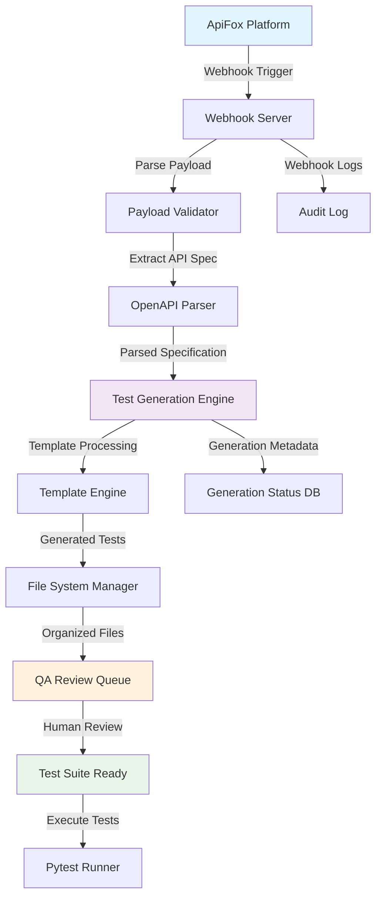

# API Specifications & Data Flow - ApiFox Webhook Test Automation

*Phase 4: Solution Design - Detailed Technical Specifications*  
*Date: 2025-08-21*

---

## 🔗 System API Specifications

### 1. Webhook Server API

#### 1.1 ApiFox Webhook Endpoint
```yaml
POST /webhook/apifox
Content-Type: application/json
Headers:
  - X-ApiFox-Signature: string (webhook verification)
  - X-ApiFox-Event: string (event type)
  - User-Agent: ApiFox-Webhook/1.0

Request Body:
  event_type: string          # "api_created", "api_updated", "api_deleted"
  timestamp: string           # ISO 8601 timestamp
  project_id: string          # ApiFox project identifier
  api_spec: object           # OpenAPI 3.0 specification
    openapi: "3.0.0"
    info: object
    paths: object             # API endpoints and operations
    components: object        # Data models and schemas
  changes: array             # List of specific changes (for updates)
    - field: string
      old_value: any
      new_value: any
      change_type: string     # "added", "modified", "removed"

Response:
  200 OK:
    status: "success"
    message: "Webhook processed successfully"
    generation_id: string     # Unique identifier for this generation
    tests_generated: integer  # Number of test files created
    
  400 Bad Request:
    status: "error"
    message: string
    error_code: string        # "INVALID_PAYLOAD", "MISSING_SIGNATURE"
    
  500 Internal Server Error:
    status: "error"
    message: string
    error_code: string        # "GENERATION_FAILED", "SYSTEM_ERROR"
```

#### 1.2 Health Check Endpoint
```yaml
GET /health
Response:
  200 OK:
    status: "healthy"
    version: string
    uptime: integer           # Seconds since start
    last_webhook_processed: string  # ISO timestamp
    system_status:
      webhook_server: "active"
      test_generator: "active"
      file_system: "writable"
```

#### 1.3 Generation Status Endpoint
```yaml
GET /status/{generation_id}
Response:
  200 OK:
    generation_id: string
    status: string            # "processing", "completed", "failed"
    progress: integer         # 0-100 percentage
    created_at: string        # ISO timestamp
    completed_at: string      # ISO timestamp (if completed)
    tests_generated: array
      - file_path: string
        test_type: string     # "crud", "validation", "error", "performance"
        endpoint_count: integer
    errors: array             # If status is "failed"
      - message: string
        error_code: string
```

### 2. Test Generation Engine API

#### 2.1 Generate Tests Interface
```python
class TestGenerationEngine:
    async def generate_tests(
        self, 
        api_spec: OpenAPISpec,
        generation_config: GenerationConfig
    ) -> GenerationResult:
        """
        Generate comprehensive pytest test suites from OpenAPI specification
        
        Args:
            api_spec: Parsed OpenAPI 3.0 specification
            generation_config: Test generation parameters
            
        Returns:
            GenerationResult with created test files and metadata
        """
        pass

@dataclass
class GenerationConfig:
    output_directory: str = "tests/generated"
    test_types: List[str] = ["crud", "validation", "error", "performance"]
    template_engine: str = "jinja2"
    include_performance_tests: bool = True
    qa_review_required: bool = True
    custom_templates: Dict[str, str] = None
    
    # AI Extension Points (future)
    ai_enhancement_enabled: bool = False
    ai_provider: Optional[str] = None
    ai_model: Optional[str] = None

@dataclass
class GenerationResult:
    success: bool
    generation_id: str
    files_created: List[GeneratedTestFile]
    total_tests: int
    generation_time: float
    errors: List[str]
    warnings: List[str]

@dataclass
class GeneratedTestFile:
    file_path: str
    test_type: str
    endpoint_path: str
    http_method: str
    test_count: int
    requires_review: bool
    template_used: str
```

---

## 📊 Data Flow Architecture

### 1. High-Level Data Flow Diagram



### 2. Detailed Component Data Flow

#### 2.1 Webhook Processing Flow
```
ApiFox Webhook → Webhook Server → Processing Pipeline
                      ↓
                 Signature Validation
                      ↓
                 Event Type Routing
                      ↓
                 Payload Extraction
                      ↓
                 OpenAPI Validation
                      ↓
                 Generation Trigger
```

#### 2.2 Test Generation Pipeline
```
OpenAPI Spec → Endpoint Analysis → Test Type Classification
                    ↓
               Schema Analysis → Data Model Extraction
                    ↓
               Operation Analysis → CRUD Pattern Detection
                    ↓
               Template Selection → Test Case Generation
                    ↓
               File Organization → QA Review Preparation
                    ↓
               Status Update → Completion Notification
```

### 3. Data Transformation Flow

#### 3.1 ApiFox Webhook Payload → OpenAPI Spec
```python
# Input: ApiFox Webhook Payload
webhook_payload = {
    "event_type": "api_updated",
    "timestamp": "2025-08-21T10:30:00Z",
    "project_id": "proj_12345",
    "api_spec": {
        "openapi": "3.0.0",
        "info": {"title": "User Management API", "version": "1.0.0"},
        "paths": {
            "/users": {
                "get": {"summary": "Get all users", ...},
                "post": {"summary": "Create user", ...}
            },
            "/users/{id}": {
                "get": {"summary": "Get user by ID", ...},
                "put": {"summary": "Update user", ...},
                "delete": {"summary": "Delete user", ...}
            }
        },
        "components": {
            "schemas": {
                "User": {
                    "type": "object",
                    "properties": {
                        "id": {"type": "integer"},
                        "name": {"type": "string"},
                        "email": {"type": "string", "format": "email"}
                    }
                }
            }
        }
    }
}

# Output: Parsed Test Generation Input
generation_input = {
    "endpoints": [
        {
            "path": "/users",
            "method": "GET",
            "operation_id": "get_all_users",
            "test_types": ["crud", "validation", "performance"],
            "expected_responses": [200, 400, 500]
        },
        {
            "path": "/users",
            "method": "POST", 
            "operation_id": "create_user",
            "test_types": ["crud", "validation", "error"],
            "request_schema": "User",
            "expected_responses": [201, 400, 409, 500]
        }
        # ... more endpoints
    ],
    "schemas": {
        "User": {
            "required_fields": ["name", "email"],
            "validation_rules": {
                "email": "format:email"
            }
        }
    }
}
```

#### 3.2 Test Generation Template Processing
```python
# Template Input Data
template_data = {
    "endpoint": {
        "path": "/users/{id}",
        "method": "PUT",
        "operation_id": "update_user"
    },
    "test_scenarios": [
        {
            "name": "test_update_user_success",
            "type": "crud",
            "description": "Successfully update user with valid data"
        },
        {
            "name": "test_update_user_not_found", 
            "type": "error",
            "description": "Return 404 when user ID doesn't exist"
        },
        {
            "name": "test_update_user_validation_error",
            "type": "validation", 
            "description": "Return 400 for invalid email format"
        }
    ],
    "data_models": {
        "User": {
            "valid_data": {
                "name": "John Doe",
                "email": "john@example.com"
            },
            "invalid_data": {
                "name": "",
                "email": "invalid-email"
            }
        }
    }
}

# Generated Test Output
"""
# tests/generated/test_users_api.py
import pytest
from api_client import APIClient

class TestUsersAPI:
    @pytest.fixture
    def api_client(self):
        return APIClient(base_url="http://localhost:8000")
    
    def test_update_user_success(self, api_client):
        user_id = 1
        user_data = {
            "name": "John Doe",
            "email": "john@example.com"
        }
        
        response = api_client.put(f"/users/{user_id}", json=user_data)
        
        assert response.status_code == 200
        assert response.json()["name"] == "John Doe"
        assert response.json()["email"] == "john@example.com"
    
    def test_update_user_not_found(self, api_client):
        user_id = 99999
        user_data = {"name": "John Doe", "email": "john@example.com"}
        
        response = api_client.put(f"/users/{user_id}", json=user_data)
        
        assert response.status_code == 404
        assert "not found" in response.json()["message"].lower()
"""
```

---

## 🔧 Integration Specifications

### 1. ApiFox Integration Points

#### 1.1 Webhook Configuration
```json
{
  "webhook_url": "http://localhost:8080/webhook/apifox",
  "events": [
    "api.created",
    "api.updated", 
    "api.deleted"
  ],
  "secret": "webhook_secret_key",
  "headers": {
    "X-ApiFox-Signature": "sha256=...",
    "X-ApiFox-Event": "api.updated"
  }
}
```

#### 1.2 OpenAPI Specification Requirements
```yaml
Required OpenAPI 3.0 Fields:
  openapi: "3.0.0"           # Version specification
  info: object               # API metadata
    title: string
    version: string
  paths: object              # API endpoints (required)
    /{path}: object
      {method}: object       # HTTP method
        summary: string      # Test description
        parameters: array    # Path/query parameters
        requestBody: object  # Request schema
        responses: object    # Response definitions
  components: object         # Data models
    schemas: object          # Schema definitions

Validation Rules:
  - At least one path must be defined
  - Each operation must have at least one response
  - Schema references must be resolvable
  - Parameter types must be valid OpenAPI types
```

### 2. File System Organization

#### 2.1 Generated Test File Structure
```
tests/generated/
├── {generation_id}/
│   ├── metadata.json               # Generation metadata
│   ├── {api_name}/
│   │   ├── test_{resource}_crud.py       # CRUD operations
│   │   ├── test_{resource}_validation.py # Input validation
│   │   ├── test_{resource}_error.py      # Error scenarios  
│   │   ├── test_{resource}_performance.py # Performance tests
│   │   └── conftest.py                   # Test fixtures
│   └── reports/
│       ├── generation_report.html   # Human-readable report
│       └── coverage_analysis.json   # Test coverage analysis
```

#### 2.2 QA Review Workflow Files
```
qa_review/
├── pending/
│   └── {generation_id}/            # Tests awaiting review
├── approved/
│   └── {generation_id}/            # QA approved tests
├── rejected/
│   └── {generation_id}/            # Tests needing revision
└── templates/
    ├── review_checklist.md         # QA review criteria
    └── customization_guide.md      # Test customization guide
```

---

## 🚀 Performance & Scalability Specifications

### 1. Performance Requirements

#### 1.1 Webhook Processing Performance
```yaml
Performance Targets:
  Webhook Response Time: < 2 seconds
  Test Generation Time: < 30 seconds per API spec
  Concurrent Webhook Processing: 10 requests/second
  File I/O Operations: < 500ms per file
  
Memory Requirements:
  Base Memory Usage: < 100MB
  Per Generation Memory: < 50MB
  Maximum Concurrent Generations: 5
```

#### 1.2 Scalability Considerations
```python
# Async Processing Architecture
class WebhookServer:
    def __init__(self):
        self.generation_queue = asyncio.Queue(maxsize=100)
        self.worker_pool = WorkerPool(max_workers=5)
        
    async def process_webhook(self, payload):
        # Quick response to ApiFox
        generation_id = await self.enqueue_generation(payload)
        return {"status": "accepted", "generation_id": generation_id}
        
    async def background_processor(self):
        # Process generations asynchronously
        while True:
            generation_task = await self.generation_queue.get()
            await self.worker_pool.execute(generation_task)
```

### 2. Error Handling & Resilience

#### 2.1 Error Recovery Mechanisms
```python
class GenerationErrorHandler:
    def __init__(self):
        self.retry_policy = RetryPolicy(
            max_attempts=3,
            backoff_strategy="exponential",
            retry_conditions=["network_error", "template_error"]
        )
        
    async def handle_generation_failure(
        self, 
        generation_request: GenerationRequest,
        error: Exception
    ):
        if isinstance(error, RecoverableError):
            await self.retry_policy.retry(generation_request)
        else:
            await self.mark_generation_failed(
                generation_request.id, 
                error_message=str(error)
            )
```

---

## 📋 Integration Testing Specifications

### 1. End-to-End Test Scenarios

#### 1.1 Happy Path Test Flow
```python
async def test_complete_webhook_to_test_generation():
    # Step 1: Simulate ApiFox webhook
    webhook_payload = create_test_webhook_payload()
    
    # Step 2: Send webhook to server
    response = await webhook_client.post("/webhook/apifox", json=webhook_payload)
    assert response.status_code == 200
    
    # Step 3: Verify generation started
    generation_id = response.json()["generation_id"]
    
    # Step 4: Wait for completion
    await wait_for_generation_completion(generation_id)
    
    # Step 5: Verify test files created
    test_files = list_generated_test_files(generation_id)
    assert len(test_files) > 0
    
    # Step 6: Verify test files are valid
    for test_file in test_files:
        assert validate_pytest_syntax(test_file)
        assert validate_test_completeness(test_file)
```

#### 1.2 Error Scenario Testing  
```python
test_scenarios = [
    "invalid_webhook_signature",
    "malformed_openapi_spec", 
    "missing_required_fields",
    "template_rendering_failure",
    "file_system_write_error",
    "concurrent_generation_overload"
]
```

---

**API Specifications Complete** ✅  
**Next Phase 4 Deliverable**: Define pytest test generation templates and patterns
