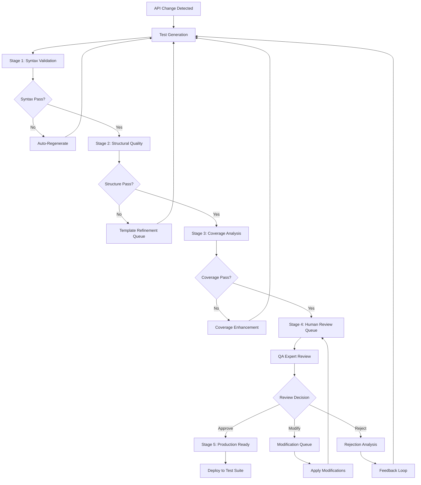

# Enterprise QA Strategy for AI API Test Automation
*Comprehensive Quality Assurance Framework*  
*Date: 2025-09-01*  
*Version: 1.0*  
*Document Owner: Michael Thompson, Global QA Lead*

---

## 🎯 Executive Summary

This document establishes enterprise-grade quality assurance standards and workflow architecture for the AI API test automation system. Based on comprehensive analysis of the existing codebase and infrastructure, this strategy defines quality gates, review processes, and success metrics that ensure generated tests meet production standards while maintaining efficiency targets.

**Strategic Objectives:**
- Achieve 90% automated quality validation before human review
- Maintain 15-minute average review time per API endpoint
- Establish 95% test reliability score for generated tests
- Implement multi-stage quality gates with clear pass/fail criteria
- Enable scalable quality processes supporting 100+ APIs per week

---

## 📋 Current System Architecture Assessment

### Existing Quality Infrastructure
The system demonstrates solid foundation components:

**Strengths Identified:**
- Comprehensive `TestQualityChecker` with 12 validation categories
- Advanced test generators supporting 6 test types (error scenarios, performance, validation, boundary, environment, concurrency)
- Established review workflow with database-backed tracking (`ReviewWorkflow`, `ReviewComment`, `ReviewMetrics`)
- Quality scoring framework with configurable thresholds
- Integrated circuit breaker and retry mechanisms for reliability

**Quality Gaps Requiring Enhancement:**
- Quality gates are reactive rather than proactive in the workflow
- Limited integration between quality checker and review workflow
- Missing automated quality gate enforcement before human review
- No structured feedback loop for quality improvement
- Insufficient quality metrics aggregation and reporting

---

## 🏗️ Quality Gate Architecture

### Multi-Stage Quality Gate Framework

```yaml
quality_gate_stages:
  stage_1_syntax_validation:
    purpose: "Ensure basic code quality and executability"
    automation_level: 100%
    blocking_criteria:
      - python_syntax_valid: true
      - imports_resolvable: true  
      - pytest_collection_successful: true
      - no_forbidden_patterns: true
    pass_threshold: 100%
    failure_action: "automatic_regeneration"
    
  stage_2_structural_quality:
    purpose: "Validate test structure and organization"
    automation_level: 95%
    quality_criteria:
      - test_method_count: ">= 3"
      - assertion_ratio: ">= 0.3 per test"
      - naming_conventions: "compliant"
      - documentation_coverage: ">= 80%"
      - method_length: "<= 50 lines"
    pass_threshold: 85%
    failure_action: "template_refinement_queue"
    
  stage_3_functional_coverage:
    purpose: "Ensure adequate test coverage for API functionality"  
    automation_level: 80%
    coverage_criteria:
      - endpoint_methods_covered: ">= 90%"
      - error_scenarios_included: ">= 3 per endpoint"
      - boundary_value_tests: ">= 2 per parameter"
      - authentication_tests: "present_if_required"
      - performance_benchmarks: "present_for_critical_apis"
    pass_threshold: 90%
    failure_action: "coverage_enhancement_queue"
    
  stage_4_business_logic_validation:
    purpose: "Validate business rule implementation and domain accuracy"
    automation_level: 20%
    manual_review_criteria:
      - business_workflow_accuracy: "40% weight"
      - domain_compliance: "30% weight" 
      - security_considerations: "20% weight"
      - maintainability: "10% weight"
    pass_threshold: 75%
    failure_action: "expert_review_required"
    
  stage_5_production_readiness:
    purpose: "Final validation for production deployment"
    automation_level: 60%
    readiness_criteria:
      - integration_test_execution: "successful"
      - performance_baselines: "established"
      - security_scan: "passed"
      - documentation: "complete"
      - stakeholder_approval: "obtained"
    pass_threshold: 95%
    failure_action: "production_hold"
```

### Quality Gate Integration Points

```python
class QualityGateOrchestrator:
    """Orchestrates quality gates within the existing workflow"""
    
    def __init__(self):
        self.quality_checker = TestQualityChecker()
        self.config_manager = get_config_manager()
        
    async def execute_quality_gates(
        self, 
        generated_test_id: int, 
        test_content: str, 
        test_file_path: str
    ) -> QualityGateResult:
        """Execute all quality gates and return comprehensive results"""
        
        results = QualityGateResult()
        
        # Stage 1: Syntax Validation (Blocking)
        syntax_result = await self._execute_syntax_validation(test_file_path)
        results.add_stage_result("syntax", syntax_result)
        
        if not syntax_result.passed:
            return results  # Fail fast on syntax issues
            
        # Stage 2: Structural Quality
        structure_result = await self._execute_structural_validation(test_content, test_file_path)
        results.add_stage_result("structure", structure_result)
        
        # Stage 3: Functional Coverage
        coverage_result = await self._execute_coverage_validation(test_content, test_file_path)
        results.add_stage_result("coverage", coverage_result)
        
        # Stage 4: Business Logic (Human Review Required)
        if results.automated_stages_passed():
            business_result = await self._queue_business_logic_review(generated_test_id)
            results.add_stage_result("business_logic", business_result)
        
        return results
        
    async def _execute_syntax_validation(self, test_file_path: str) -> StageResult:
        """Execute Stage 1 quality gates"""
        quality_report = self.quality_checker.check_test_file(test_file_path)
        
        # Check for blocking issues
        has_syntax_errors = any(
            issue.severity == 'error' and issue.category == 'syntax' 
            for issue in quality_report.issues
        )
        
        has_forbidden_patterns = any(
            issue.category == 'patterns'
            for issue in quality_report.issues
        )
        
        pytest_valid, pytest_error = self.quality_checker.validate_with_pytest(test_file_path)
        
        return StageResult(
            stage_name="syntax_validation",
            passed=not has_syntax_errors and not has_forbidden_patterns and pytest_valid,
            score=1.0 if not has_syntax_errors else 0.0,
            issues=quality_report.issues,
            recommendations=self._generate_syntax_recommendations(quality_report)
        )
```

---

## 🔄 Multi-Stage Review Workflow Architecture

### Enhanced Review Process Flow



### Review Workflow Implementation

```python
class EnhancedReviewWorkflow:
    """Enhanced review workflow with integrated quality gates"""
    
    def __init__(self):
        self.quality_orchestrator = QualityGateOrchestrator()
        self.review_service = ReviewService()
        self.notification_service = NotificationService()
        
    async def process_generated_test(
        self, 
        webhook_event_id: str,
        test_content: str,
        test_file_path: str,
        db: Session
    ) -> WorkflowResult:
        """Process generated test through quality gates and review workflow"""
        
        try:
            # Create initial database record
            generated_test = GeneratedTest(
                webhook_event_id=webhook_event_id,
                test_name=Path(test_file_path).stem,
                test_content=test_content,
                file_path=test_file_path,
                status="quality_checking"
            )
            db.add(generated_test)
            db.flush()  # Get the ID
            
            # Execute quality gates
            quality_result = await self.quality_orchestrator.execute_quality_gates(
                generated_test.id, test_content, test_file_path
            )
            
            # Determine next action based on quality gate results
            if quality_result.requires_regeneration():
                return await self._handle_regeneration_required(
                    generated_test, quality_result, db
                )
            elif quality_result.requires_human_review():
                return await self._create_human_review(
                    generated_test, quality_result, db
                )
            elif quality_result.auto_approvable():
                return await self._auto_approve_test(
                    generated_test, quality_result, db
                )
            else:
                return await self._handle_quality_gate_failure(
                    generated_test, quality_result, db
                )
                
        except Exception as e:
            logger.error("Workflow processing failed", 
                        test_file=test_file_path, error=str(e))
            raise
            
    async def _create_human_review(
        self, 
        generated_test: GeneratedTest,
        quality_result: QualityGateResult,
        db: Session
    ) -> WorkflowResult:
        """Create human review workflow with quality context"""
        
        # Determine priority based on quality scores and API criticality
        priority = self._calculate_review_priority(quality_result, generated_test)
        
        # Create review workflow
        review_workflow = ReviewWorkflow(
            generated_test_id=generated_test.id,
            title=f"Review: {generated_test.test_name}",
            description=f"Generated test requires review. Quality score: {quality_result.overall_score:.1%}",
            priority=priority,
            status=ReviewStatus.PENDING,
            workflow_metadata={
                "quality_gates": quality_result.to_dict(),
                "auto_review_eligible": quality_result.overall_score >= 0.8,
                "estimated_review_time": self._estimate_review_time(quality_result)
            }
        )
        db.add(review_workflow)
        
        # Create initial metrics record
        review_metrics = ReviewMetrics(
            review_workflow_id=review_workflow.id,
            code_quality_score=int(quality_result.overall_score * 10),
            overall_score=int(quality_result.overall_score * 10)
        )
        db.add(review_metrics)
        
        # Add quality gate feedback as comments
        for stage_name, stage_result in quality_result.stage_results.items():
            if stage_result.issues:
                comment_content = self._format_quality_feedback(stage_result)
                review_comment = ReviewComment(
                    review_workflow_id=review_workflow.id,
                    author_id="quality_system",
                    content=comment_content,
                    comment_type=CommentType.ISSUE if not stage_result.passed else CommentType.SUGGESTION,
                    comment_metadata={"automated": True, "stage": stage_name}
                )
                db.add(review_comment)
        
        # Update generated test status
        generated_test.status = "pending_review"
        
        db.commit()
        
        # Send notification to appropriate reviewers
        await self._notify_reviewers(review_workflow, quality_result)
        
        return WorkflowResult(
            success=True,
            action="human_review_created",
            review_id=review_workflow.id,
            estimated_completion_time=self._estimate_review_time(quality_result)
        )
```

---

## 📊 Quality Metrics and Measurement Framework

### Core Quality Metrics

```yaml
quality_metrics_framework:
  test_quality_metrics:
    syntax_quality_score:
      calculation: "syntax_errors == 0 ? 1.0 : 0.0"
      target: 1.0
      frequency: "per_test"
      
    structural_quality_score:
      calculation: "weighted_average(naming, organization, documentation, maintainability)"
      target: ">= 0.85"
      frequency: "per_test"
      
    functional_coverage_score:
      calculation: "(covered_scenarios / required_scenarios) * completeness_factor"
      target: ">= 0.90"
      frequency: "per_api_endpoint"
      
    business_logic_accuracy:
      calculation: "expert_review_score (1-10 scale)"
      target: ">= 8.0"
      frequency: "per_business_critical_test"
      
  workflow_efficiency_metrics:
    average_review_time:
      calculation: "sum(review_duration) / count(reviews)"
      target: "<= 15 minutes"
      frequency: "daily, weekly, monthly"
      
    quality_gate_pass_rate:
      calculation: "passed_gates / total_gates"
      target: ">= 0.85"
      frequency: "per_stage, overall"
      
    auto_approval_rate:
      calculation: "auto_approved_tests / total_generated_tests"
      target: "40-60%"
      frequency: "weekly"
      
    regeneration_rate:
      calculation: "regenerated_tests / total_generated_tests"
      target: "<= 0.15"
      frequency: "weekly"
      
  production_quality_metrics:
    test_reliability_score:
      calculation: "(successful_runs / total_runs) over 30_days"
      target: ">= 0.95"
      frequency: "daily monitoring"
      
    false_positive_rate:
      calculation: "false_failures / total_failures"
      target: "<= 0.05"
      frequency: "weekly analysis"
      
    defect_detection_rate:
      calculation: "bugs_found_by_tests / total_bugs_found"
      target: ">= 0.80"
      frequency: "monthly analysis"
```

### Quality Dashboard Implementation

```python
class QualityMetricsDashboard:
    """Real-time quality metrics dashboard"""
    
    def __init__(self):
        self.db_session = get_db_session()
        self.cache = QualityMetricsCache()
        
    async def get_quality_overview(self, time_period: str = "7d") -> QualityOverview:
        """Get comprehensive quality metrics overview"""
        
        return QualityOverview(
            overall_quality_score=await self._calculate_overall_quality_score(time_period),
            quality_trends=await self._get_quality_trends(time_period),
            stage_performance=await self._get_stage_performance_metrics(time_period),
            efficiency_metrics=await self._get_efficiency_metrics(time_period),
            alerts=await self._get_quality_alerts()
        )
        
    async def _calculate_overall_quality_score(self, time_period: str) -> float:
        """Calculate weighted overall quality score"""
        
        # Get raw metrics
        syntax_score = await self._get_syntax_quality_score(time_period)
        structure_score = await self._get_structural_quality_score(time_period)
        coverage_score = await self._get_coverage_quality_score(time_period)
        business_score = await self._get_business_logic_score(time_period)
        
        # Apply enterprise weighting
        weights = {
            'syntax': 0.20,        # Must be perfect, but table stakes
            'structure': 0.25,     # Important for maintainability
            'coverage': 0.30,      # Critical for effectiveness
            'business': 0.25       # Essential for business value
        }
        
        overall_score = (
            syntax_score * weights['syntax'] +
            structure_score * weights['structure'] +
            coverage_score * weights['coverage'] +
            business_score * weights['business']
        )
        
        return round(overall_score, 3)
        
    async def generate_quality_report(self, report_type: str = "weekly") -> QualityReport:
        """Generate comprehensive quality report"""
        
        report = QualityReport(
            report_type=report_type,
            generated_at=datetime.utcnow(),
            period=self._get_report_period(report_type)
        )
        
        # Quality Metrics Section
        report.quality_metrics = await self.get_quality_overview(self._get_period_string(report_type))
        
        # Trend Analysis
        report.trend_analysis = await self._analyze_quality_trends(report_type)
        
        # Issue Analysis
        report.issue_analysis = await self._analyze_common_issues(report_type)
        
        # Recommendations
        report.recommendations = await self._generate_improvement_recommendations(report)
        
        # Risk Assessment
        report.risk_assessment = await self._assess_quality_risks(report)
        
        return report
```

---

## 🎯 Integration Architecture

### Quality Gate Integration with Existing Codebase

```python
# Enhanced TestGenerator with integrated quality gates
class EnhancedTestGenerator(TestGenerator):
    """Extended test generator with integrated quality validation"""
    
    def __init__(self):
        super().__init__()
        self.quality_orchestrator = QualityGateOrchestrator()
        self.review_workflow = EnhancedReviewWorkflow()
        
    async def generate_advanced_tests_with_comprehensive_quality(
        self, 
        webhook: ApiFoxWebhook, 
        db: Session
    ) -> Dict[str, Any]:
        """Generate tests with comprehensive quality validation and workflow integration"""
        
        try:
            logger.info("Starting comprehensive test generation with quality gates", 
                       event_id=webhook.event_id)
            
            # Extract and standardize API specification
            api_spec = self._extract_api_spec(webhook)
            if not api_spec:
                return {"success": False, "error": "No valid API spec found"}
            
            standardized_spec = self._standardize_api_spec(api_spec)
            
            # Generate tests using advanced generators
            generation_results = []
            overall_quality_summary = QualityAggregator()
            
            # Determine test types based on API characteristics and risk profile
            test_types = self._determine_test_types_with_risk_analysis(api_spec)
            
            for test_type in test_types:
                try:
                    # Generate test content
                    test_file_path = await self._generate_advanced_test_file(
                        standardized_spec, test_type
                    )
                    
                    with open(test_file_path, 'r', encoding='utf-8') as f:
                        test_content = f.read()
                    
                    # Execute comprehensive quality gates
                    workflow_result = await self.review_workflow.process_generated_test(
                        webhook.event_id, test_content, test_file_path, db
                    )
                    
                    generation_results.append({
                        "test_type": test_type,
                        "file_path": test_file_path,
                        "workflow_result": workflow_result.to_dict(),
                        "next_action": workflow_result.action
                    })
                    
                    overall_quality_summary.add_result(workflow_result)
                    
                    logger.info(f"Processed {test_type} test through quality gates", 
                               action=workflow_result.action,
                               quality_score=workflow_result.quality_score)
                    
                except Exception as e:
                    logger.error(f"Failed to process {test_type} test", error=str(e))
                    generation_results.append({
                        "test_type": test_type,
                        "error": str(e),
                        "next_action": "manual_intervention_required"
                    })
                    continue
            
            # Update webhook processing metadata
            await self._update_webhook_processing_metadata(
                webhook.event_id, generation_results, overall_quality_summary, db
            )
            
            result = {
                "success": True,
                "webhook_event_id": webhook.event_id,
                "generation_results": generation_results,
                "quality_summary": overall_quality_summary.get_summary(),
                "workflow_statistics": {
                    "auto_approved": overall_quality_summary.auto_approved_count,
                    "requiring_review": overall_quality_summary.review_required_count,
                    "requiring_regeneration": overall_quality_summary.regeneration_required_count
                },
                "estimated_completion_time": overall_quality_summary.estimated_total_time
            }
            
            logger.info("Comprehensive test generation completed", 
                       event_id=webhook.event_id,
                       auto_approved=result["workflow_statistics"]["auto_approved"],
                       requiring_review=result["workflow_statistics"]["requiring_review"])
            
            return result
            
        except Exception as e:
            logger.error("Comprehensive test generation failed", 
                        event_id=webhook.event_id, error=str(e))
            return {"success": False, "error": str(e)}
```

### Review Routes Enhancement

```python
# Enhanced review routes with quality gate integration
@review_router.get("/quality-dashboard", response_class=HTMLResponse)
async def quality_dashboard(
    request: Request,
    time_period: str = Query("7d", regex="^(24h|7d|30d|90d)$"),
    db: Session = Depends(get_db)
):
    """Quality metrics dashboard showing overall system health"""
    
    dashboard = QualityMetricsDashboard()
    quality_overview = await dashboard.get_quality_overview(time_period)
    
    return templates.TemplateResponse("quality_dashboard.html", {
        "request": request,
        "quality_overview": quality_overview,
        "time_period": time_period,
        "refresh_interval": 300  # 5 minutes
    })

@review_router.get("/{review_id}/quality-details", response_class=HTMLResponse) 
async def review_quality_details(
    request: Request,
    review_id: int,
    db: Session = Depends(get_db)
):
    """Detailed quality analysis for a specific review"""
    
    review = await review_service.get_review_details(review_id)
    if not review:
        raise HTTPException(status_code=404, detail="Review not found")
    
    # Get quality gate results from workflow metadata
    quality_gates_data = review.workflow_metadata.get("quality_gates", {})
    
    return templates.TemplateResponse("quality_details.html", {
        "request": request,
        "review": review,
        "quality_gates": quality_gates_data,
        "quality_recommendations": await generate_quality_recommendations(quality_gates_data)
    })

@review_router.post("/{review_id}/quality-recheck")
async def recheck_quality(
    review_id: int,
    background_tasks: BackgroundTasks,
    db: Session = Depends(get_db)
):
    """Trigger quality recheck for a review"""
    
    review = await review_service.get_review_details(review_id)
    if not review:
        raise HTTPException(status_code=404, detail="Review not found")
    
    # Queue quality recheck
    background_tasks.add_task(
        rerun_quality_gates,
        review.generated_test.file_path,
        review_id,
        db
    )
    
    return {"status": "quality_recheck_queued", "review_id": review_id}
```

---

## 🚨 Risk Mitigation Strategies

### Quality Risk Assessment Matrix

```yaml
risk_mitigation_framework:
  high_risk_scenarios:
    inadequate_automated_coverage:
      risk_description: "Quality gates miss critical issues, leading to production failures"
      impact: "HIGH - Production incidents, customer impact"
      probability: "MEDIUM"
      mitigation_strategies:
        - "Comprehensive quality gate testing with synthetic failure injection"
        - "Regular calibration against production issue patterns"
        - "Human expert sampling of auto-approved tests"
      monitoring_indicators:
        - "Production defect rate > 2%"
        - "False negative rate in quality gates > 5%"
        - "Customer-reported issues with generated tests"
        
    review_bottlenecks:
      risk_description: "Human review queue becomes backlogged, slowing delivery"
      impact: "MEDIUM - Delivery delays, team productivity impact"
      probability: "HIGH"
      mitigation_strategies:
        - "Dynamic reviewer allocation based on queue length"
        - "Automated priority scoring for review ordering"
        - "Escalation procedures for aged reviews"
        - "Cross-training to increase reviewer pool"
      monitoring_indicators:
        - "Average review queue time > 24 hours"
        - "Reviewer utilization > 80%"
        - "Review SLA breaches > 10%"
        
    quality_drift:
      risk_description: "Quality standards degrade over time due to pressure or complacency"
      impact: "HIGH - Long-term system reliability and maintainability"
      probability: "MEDIUM"
      mitigation_strategies:
        - "Regular quality calibration sessions"
        - "Quality trend monitoring and alerting"
        - "Automated quality baseline enforcement"
        - "Regular review of quality gate effectiveness"
      monitoring_indicators:
        - "Overall quality score trending downward > 5% per month"
        - "Increasing regeneration rates"
        - "Production issues traced to quality gaps"

  medium_risk_scenarios:
    tool_adoption_challenges:
      risk_description: "QA team struggles to effectively use new quality tools"
      impact: "MEDIUM - Reduced efficiency, inconsistent quality"
      probability: "MEDIUM"
      mitigation_strategies:
        - "Comprehensive training program with hands-on practice"
        - "Progressive rollout with feedback loops"
        - "Champion program with super-users"
        - "Regular user experience assessment and improvement"
      monitoring_indicators:
        - "Tool usage adoption < 80%"
        - "User satisfaction scores < 7/10"
        - "Increase in manual workaround usage"
        
    inconsistent_quality_standards:
      risk_description: "Different reviewers apply different quality standards"
      impact: "MEDIUM - Inconsistent test quality, team friction"
      probability: "HIGH"
      mitigation_strategies:
        - "Detailed quality rubrics and guidelines"
        - "Regular reviewer calibration sessions"
        - "Peer review sampling and feedback"
        - "Quality decision audit trail"
      monitoring_indicators:
        - "High variance in review scores between reviewers"
        - "Appeals or disputes on quality decisions"
        - "Inconsistent patterns in review feedback"
```

### Continuous Improvement Framework

```python
class QualityImprovementEngine:
    """Continuous improvement engine for quality processes"""
    
    def __init__(self):
        self.metrics_collector = QualityMetricsCollector()
        self.analyzer = QualityTrendAnalyzer()
        self.recommender = QualityImprovementRecommender()
        
    async def analyze_quality_trends(self) -> QualityTrendAnalysis:
        """Analyze quality trends and identify improvement opportunities"""
        
        # Collect metrics over time
        historical_data = await self.metrics_collector.get_historical_metrics(
            time_range="90d",
            granularity="daily"
        )
        
        # Analyze trends
        trend_analysis = await self.analyzer.analyze_trends(historical_data)
        
        # Generate recommendations
        recommendations = await self.recommender.generate_recommendations(
            trend_analysis, historical_data
        )
        
        return QualityTrendAnalysis(
            trends=trend_analysis,
            recommendations=recommendations,
            priority_actions=self._prioritize_actions(recommendations),
            success_metrics=self._define_success_metrics(recommendations)
        )
        
    async def generate_monthly_quality_report(self) -> MonthlyQualityReport:
        """Generate comprehensive monthly quality report"""
        
        report = MonthlyQualityReport()
        
        # Quality performance analysis
        report.performance_analysis = await self._analyze_quality_performance()
        
        # Process efficiency analysis
        report.efficiency_analysis = await self._analyze_process_efficiency()
        
        # Risk assessment update
        report.risk_assessment = await self._update_risk_assessment()
        
        # Improvement initiatives tracking
        report.improvement_tracking = await self._track_improvement_initiatives()
        
        # Recommendations for next period
        report.next_period_recommendations = await self._generate_next_period_recommendations()
        
        return report
        
    def _prioritize_actions(self, recommendations: List[Recommendation]) -> List[PriorityAction]:
        """Prioritize improvement actions based on impact and effort"""
        
        priority_actions = []
        
        for rec in recommendations:
            priority_score = self._calculate_priority_score(
                impact=rec.estimated_impact,
                effort=rec.estimated_effort,
                urgency=rec.urgency_level
            )
            
            priority_actions.append(PriorityAction(
                recommendation=rec,
                priority_score=priority_score,
                recommended_timeline=self._suggest_timeline(rec),
                resource_requirements=self._estimate_resources(rec)
            ))
        
        return sorted(priority_actions, key=lambda x: x.priority_score, reverse=True)
```

---

## 📈 Success Criteria and KPIs

### Primary Success Metrics

```yaml
success_criteria:
  quality_excellence_kpis:
    overall_quality_score:
      target: ">= 0.90"
      measurement: "Weighted average of all quality dimensions"
      frequency: "Daily monitoring, weekly reporting"
      
    test_reliability_score:
      target: ">= 0.95"
      measurement: "(Successful test runs / Total test runs) over 30 days"
      frequency: "Daily monitoring"
      
    production_defect_rate:
      target: "<= 0.02"
      measurement: "(Production bugs / Total generated tests) per month"
      frequency: "Monthly analysis"
      
  efficiency_excellence_kpis:
    average_review_time:
      target: "<= 15 minutes"
      measurement: "Mean time from review assignment to completion"
      frequency: "Daily monitoring"
      
    auto_approval_rate:
      target: "40-60%"
      measurement: "(Auto-approved tests / Total generated tests) per week"
      frequency: "Weekly monitoring"
      
    quality_gate_pass_rate:
      target: ">= 0.85"
      measurement: "(Tests passing all automated gates / Total tests) per week"
      frequency: "Weekly monitoring"
      
  process_excellence_kpis:
    reviewer_satisfaction:
      target: ">= 8.0/10"
      measurement: "Monthly reviewer satisfaction survey"
      frequency: "Monthly survey"
      
    time_to_production:
      target: "<= 2 hours from webhook to production-ready tests"
      measurement: "End-to-end workflow completion time"
      frequency: "Weekly analysis"
      
    quality_improvement_rate:
      target: "5% improvement in overall score per quarter"
      measurement: "Quarter-over-quarter quality score improvement"
      frequency: "Quarterly analysis"
```

### Success Measurement Dashboard

```python
class SuccessCriteriaDashboard:
    """Dashboard for tracking success criteria and KPIs"""
    
    async def get_kpi_status(self) -> KPIStatus:
        """Get current status of all KPIs"""
        
        return KPIStatus(
            quality_kpis=await self._get_quality_kpis(),
            efficiency_kpis=await self._get_efficiency_kpis(),
            process_kpis=await self._get_process_kpis(),
            overall_health_score=await self._calculate_overall_health(),
            alerts=await self._get_kpi_alerts(),
            trends=await self._get_kpi_trends()
        )
        
    async def generate_success_report(self, period: str = "monthly") -> SuccessReport:
        """Generate comprehensive success criteria report"""
        
        report = SuccessReport(period=period)
        
        # KPI Performance
        report.kpi_performance = await self._analyze_kpi_performance(period)
        
        # Success Story Highlights
        report.success_highlights = await self._identify_success_stories(period)
        
        # Areas for Improvement
        report.improvement_areas = await self._identify_improvement_opportunities(period)
        
        # Forecast and Predictions
        report.forecast = await self._generate_performance_forecast(period)
        
        return report
```

---

## 🔄 Implementation Roadmap

### Phase-Based Implementation Schedule

```yaml
implementation_phases:
  phase_1_foundation: # Weeks 1-2
    objectives:
      - "Integrate quality gates with existing TestQualityChecker"
      - "Enhance ReviewWorkflow with quality metadata"
      - "Implement basic automated quality validation"
    deliverables:
      - "QualityGateOrchestrator implementation"
      - "Enhanced database schema for quality tracking"
      - "Basic quality dashboard"
    success_criteria:
      - "Automated quality gates operational"
      - "Quality scores stored in database"
      - "Basic workflow integration complete"
      
  phase_2_workflow_integration: # Weeks 3-4
    objectives:
      - "Complete EnhancedReviewWorkflow implementation"
      - "Integrate quality gates with test generation"
      - "Implement structured feedback system"
    deliverables:
      - "Full workflow automation"
      - "Quality-based routing logic"
      - "Structured rejection feedback system"
    success_criteria:
      - "Tests automatically routed based on quality scores"
      - "Human review queue prioritized by quality metrics"
      - "Rejection feedback generates actionable improvements"
      
  phase_3_metrics_and_reporting: # Weeks 5-6
    objectives:
      - "Implement comprehensive metrics collection"
      - "Create quality dashboards and reporting"
      - "Establish KPI monitoring and alerting"
    deliverables:
      - "QualityMetricsDashboard complete"
      - "Automated reporting system"
      - "KPI monitoring and alerting"
    success_criteria:
      - "Real-time quality metrics available"
      - "Automated quality reports generated"
      - "SLA breach alerts operational"
      
  phase_4_optimization_and_intelligence: # Weeks 7-8
    objectives:
      - "Implement quality improvement engine"
      - "Add predictive quality analytics"
      - "Optimize workflow based on initial data"
    deliverables:
      - "QualityImprovementEngine operational"
      - "Predictive quality models"
      - "Workflow optimization recommendations"
    success_criteria:
      - "Continuous improvement recommendations generated"
      - "Quality predictions accurate within 10%"
      - "Workflow efficiency improved by 15%"
```

### Risk-Based Implementation Strategy

```python
class ImplementationRiskManagement:
    """Manages risks during implementation phases"""
    
    implementation_risks = {
        "integration_complexity": {
            "risk": "Complex integration with existing codebase causes delays",
            "mitigation": "Incremental integration with rollback capability",
            "contingency": "Parallel implementation with gradual migration"
        },
        
        "performance_impact": {
            "risk": "Quality gates add significant latency to workflow",
            "mitigation": "Performance testing and optimization in each phase",
            "contingency": "Simplified quality gates with async processing"
        },
        
        "user_adoption": {
            "risk": "QA team resistance to new workflow processes",
            "mitigation": "Early involvement, training, and feedback incorporation",
            "contingency": "Hybrid manual/automated approach during transition"
        }
    }
    
    def create_phase_gate_reviews(self) -> List[PhaseGateReview]:
        """Create phase gate reviews for implementation governance"""
        
        return [
            PhaseGateReview(
                phase="foundation",
                criteria=[
                    "All automated tests pass",
                    "Performance impact < 10%",
                    "Quality gates accuracy > 90%"
                ],
                stakeholders=["QA Lead", "Tech Lead", "Product Owner"]
            ),
            PhaseGateReview(
                phase="workflow_integration",
                criteria=[
                    "Workflow processing time < 5 minutes",
                    "User acceptance testing passed",
                    "Error rate < 1%"
                ],
                stakeholders=["QA Team", "Tech Lead", "Operations"]
            )
            # Additional phase gates...
        ]
```

---

## 📝 Conclusion and Next Steps

This comprehensive QA strategy establishes enterprise-grade quality assurance for the AI API test automation system. The strategy balances automated efficiency with human expertise, ensuring generated tests meet production standards while maintaining delivery velocity.

### Key Strategic Benefits

1. **Scalable Quality Assurance**: Multi-stage quality gates enable handling of 100+ APIs per week while maintaining quality standards
2. **Risk-Based Approach**: Automated quality assessment focuses human attention on high-risk, high-value scenarios  
3. **Continuous Improvement**: Built-in feedback loops and improvement engines ensure evolving quality standards
4. **Enterprise Integration**: Architecture designed for enterprise environments with compliance, audit, and governance requirements

### Immediate Next Steps

1. **Phase 1 Implementation Begin**: Start with QualityGateOrchestrator and enhanced database schema
2. **Stakeholder Review**: Present strategy to QA team, development team, and product stakeholders
3. **Tool Selection**: Finalize tools for quality dashboard, metrics collection, and reporting
4. **Training Plan Development**: Create comprehensive training plan for QA team on new processes

### Long-term Strategic Objectives

- **Industry Leadership**: Establish the system as a benchmark for AI-assisted test generation quality
- **Predictive Quality**: Develop machine learning models to predict and prevent quality issues
- **Quality Ecosystem**: Create reusable quality patterns and standards for broader organization adoption

This strategy provides the foundation for transforming AI-generated test quality from reactive validation to proactive quality assurance, ensuring sustainable delivery of high-quality automated tests at enterprise scale.

---

**Document Status:** Complete ✅  
**Review Required:** Technical Architecture Team, QA Leadership  
**Implementation Start:** Week 1 of development cycle  
**Next Review Date:** End of Phase 1 implementation