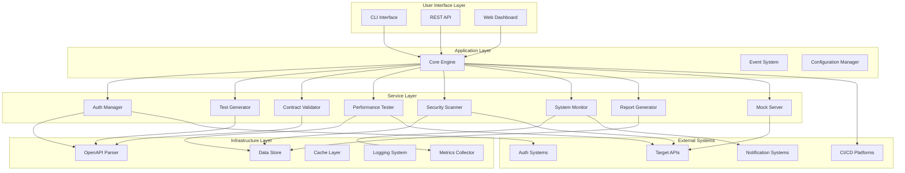
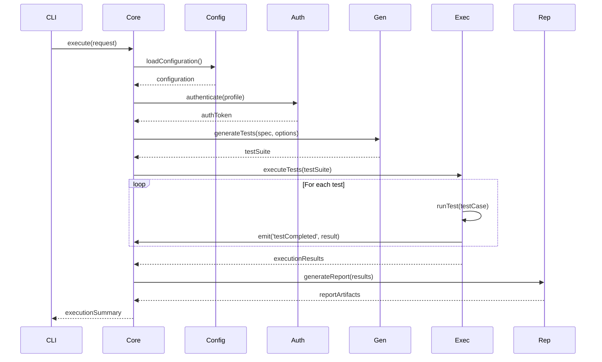
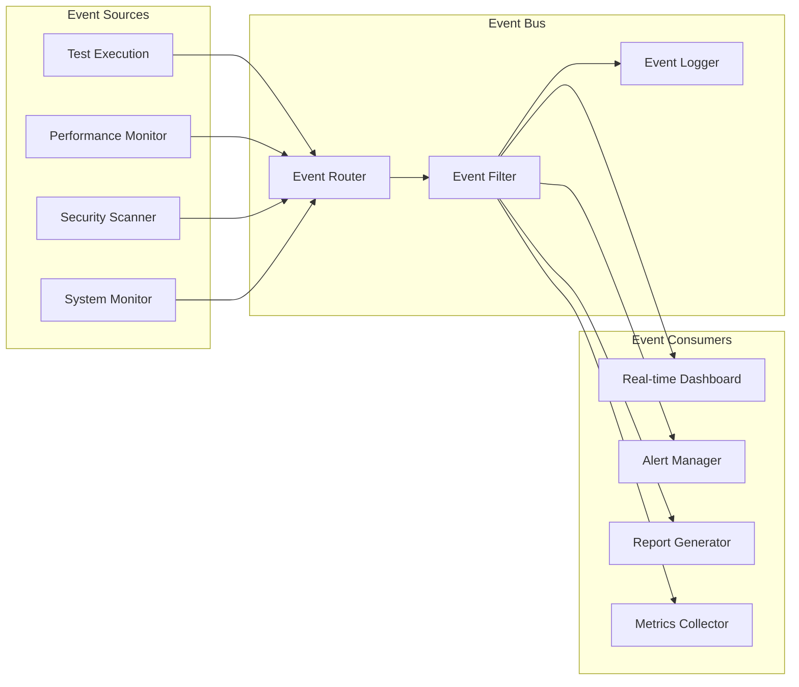

# 🏗️ Architecture Guide

Deep dive into the AI API Test Automation Framework architecture, design patterns, and implementation details.

## 📋 Table of Contents

- [System Overview](#system-overview)
- [Core Architecture](#core-architecture)
- [Component Design](#component-design)
- [Data Flow](#data-flow)
- [Design Patterns](#design-patterns)
- [Extension Points](#extension-points)
- [Performance Considerations](#performance-considerations)
- [Security Architecture](#security-architecture)

## System Overview

The AI API Test Automation Framework follows a modular, event-driven architecture designed for scalability, maintainability, and extensibility.

### High-Level Architecture



### Architectural Principles

#### 1. **Modular Design**
- Each component has a single responsibility
- Loose coupling between modules
- High cohesion within modules
- Clear interfaces and contracts

#### 2. **Event-Driven Architecture**
- Asynchronous communication between components
- Pub/sub pattern for system events
- Real-time monitoring and feedback
- Extensible event handling

#### 3. **Plugin Architecture**
- Core functionality is extensible
- Custom plugins for specific needs
- Well-defined plugin interfaces
- Hot-pluggable components

#### 4. **Configuration-Driven**
- Behavior controlled through configuration
- Environment-specific settings
- Runtime configuration updates
- Validation and defaults

## Core Architecture

### Component Hierarchy

```typescript
// Core Engine - Central orchestrator
export class CoreEngine {
  private components: Map<string, Component>;
  private eventBus: EventBus;
  private configManager: ConfigurationManager;
  
  async initialize(): Promise<void> {
    // Initialize all components
    // Setup event listeners
    // Load configuration
  }
  
  async execute(request: ExecutionRequest): Promise<ExecutionResult> {
    // Orchestrate component execution
    // Handle errors and retries
    // Emit progress events
  }
}

// Base Component Interface
export interface Component {
  name: string;
  version: string;
  dependencies: string[];
  
  initialize(config: ComponentConfig): Promise<void>;
  execute(context: ExecutionContext): Promise<ComponentResult>;
  cleanup(): Promise<void>;
}

// Event Bus for inter-component communication
export class EventBus {
  private listeners: Map<string, EventListener[]>;
  
  subscribe(event: string, listener: EventListener): void;
  publish(event: string, data: any): Promise<void>;
  unsubscribe(event: string, listener: EventListener): void;
}
```

### Configuration Management

```typescript
// Hierarchical configuration system
export interface ConfigurationSchema {
  global: GlobalConfig;
  environments: Record<string, EnvironmentConfig>;
  components: Record<string, ComponentConfig>;
  plugins: Record<string, PluginConfig>;
}

// Configuration provider with validation
export class ConfigurationManager {
  private schema: ConfigurationSchema;
  private validators: Map<string, ConfigValidator>;
  
  async loadConfig(source: ConfigSource): Promise<void>;
  validate(config: any): ValidationResult;
  get<T>(path: string): T;
  set(path: string, value: any): void;
  watch(path: string, callback: ConfigChangeCallback): void;
}
```

## Component Design

### Authentication Manager

```typescript
export class AuthManager implements Component {
  private providers: Map<string, AuthProvider>;
  private tokenCache: TokenCache;
  private profiles: Map<string, AuthProfile>;
  
  // Provider pattern for different auth types
  registerProvider(type: string, provider: AuthProvider): void;
  
  // Token management with caching and refresh
  async getToken(profileName: string): Promise<AuthToken>;
  async refreshToken(profileName: string): Promise<AuthToken>;
  
  // Request interceptor for automatic auth
  createRequestInterceptor(profileName: string): RequestInterceptor;
}

// Extensible auth provider interface
export interface AuthProvider {
  type: string;
  authenticate(config: AuthConfig): Promise<AuthToken>;
  refresh(token: AuthToken): Promise<AuthToken>;
  validate(token: AuthToken): Promise<boolean>;
}

// Built-in providers
export class OAuth2Provider implements AuthProvider {
  async authenticate(config: OAuth2Config): Promise<AuthToken> {
    // OAuth2 flow implementation
  }
}

export class JWTProvider implements AuthProvider {
  async authenticate(config: JWTConfig): Promise<AuthToken> {
    // JWT token handling
  }
}
```

### Test Generator

```typescript
export class TestGenerator implements Component {
  private strategies: Map<string, GenerationStrategy>;
  private dataGenerators: Map<string, DataGenerator>;
  private templates: Map<string, TestTemplate>;
  
  // Strategy pattern for different generation approaches
  registerStrategy(name: string, strategy: GenerationStrategy): void;
  
  // Template-based test generation
  async generateFromTemplate(
    template: TestTemplate,
    operation: Operation,
    options: GenerationOptions
  ): Promise<TestCase[]>;
  
  // AI-powered test generation
  async generateIntelligent(
    operation: Operation,
    context: GenerationContext
  ): Promise<TestCase[]>;
}

// Generation strategies
export interface GenerationStrategy {
  name: string;
  generate(
    operation: Operation,
    options: GenerationOptions
  ): Promise<TestCase[]>;
}

export class FunctionalTestStrategy implements GenerationStrategy {
  async generate(operation: Operation): Promise<TestCase[]> {
    // Generate functional test cases
    // Positive and negative scenarios
    // Boundary value testing
  }
}

export class PerformanceTestStrategy implements GenerationStrategy {
  async generate(operation: Operation): Promise<TestCase[]> {
    // Generate performance test scenarios
    // Load patterns and stress tests
  }
}
```

### Performance Tester

```typescript
export class PerformanceTester implements Component {
  private engines: Map<string, LoadTestEngine>;
  private collectors: MetricsCollector[];
  private aggregators: Map<string, MetricsAggregator>;
  
  // Multiple load testing engines
  registerEngine(name: string, engine: LoadTestEngine): void;
  
  // Real-time metrics collection
  async runLoadTest(config: LoadTestConfig): Promise<PerformanceResult> {
    const engine = this.engines.get(config.engine || 'default');
    const collector = new RealTimeMetricsCollector();
    
    // Start metrics collection
    collector.start();
    
    // Execute load test
    const result = await engine.execute(config);
    
    // Aggregate and analyze results
    const metrics = await this.aggregateMetrics(collector.getMetrics());
    
    return {
      summary: this.calculateSummary(metrics),
      metrics,
      thresholds: this.validateThresholds(metrics, config.thresholds),
      rawData: result.rawData
    };
  }
}

// Load testing engine interface
export interface LoadTestEngine {
  name: string;
  capabilities: EngineCapabilities;
  
  execute(config: LoadTestConfig): Promise<RawTestResult>;
  abort(): Promise<void>;
}

// Built-in engines
export class ConcurrentEngine implements LoadTestEngine {
  // High-concurrency testing using worker threads
}

export class DistributedEngine implements LoadTestEngine {
  // Distributed load testing across multiple nodes
}
```

### Security Scanner

```typescript
export class SecurityScanner implements Component {
  private rules: Map<string, SecurityRule>;
  private scanners: Map<string, VulnerabilityScanner>;
  private analyzers: Map<string, ResultAnalyzer>;
  
  // Rule-based security scanning
  async runScan(config: SecurityScanConfig): Promise<SecurityScanResult> {
    const findings: SecurityFinding[] = [];
    
    // Static analysis of OpenAPI spec
    const staticFindings = await this.runStaticAnalysis(config.spec);
    findings.push(...staticFindings);
    
    // Dynamic testing against live API
    if (config.baseURL) {
      const dynamicFindings = await this.runDynamicScan(config);
      findings.push(...dynamicFindings);
    }
    
    // Analyze and prioritize findings
    const analyzed = await this.analyzeFindings(findings);
    
    return {
      summary: this.calculateSecuritySummary(analyzed),
      findings: analyzed,
      coverage: this.calculateCoverage(config.spec, analyzed),
      recommendations: this.generateRecommendations(analyzed)
    };
  }
  
  // Extensible rule system
  addRule(rule: SecurityRule): void {
    this.rules.set(rule.id, rule);
  }
}

// Security rule interface
export interface SecurityRule {
  id: string;
  name: string;
  category: SecurityCategory;
  severity: SecuritySeverity;
  description: string;
  
  check(context: SecurityCheckContext): Promise<SecurityFinding[]>;
}

// OWASP Top 10 rules
export class InjectionRule implements SecurityRule {
  async check(context: SecurityCheckContext): Promise<SecurityFinding[]> {
    // Check for SQL injection vulnerabilities
    // Check for NoSQL injection
    // Check for command injection
  }
}
```

## Data Flow

### Test Execution Flow



### Event Flow



## Design Patterns

### 1. **Strategy Pattern**

Used throughout for pluggable algorithms:

```typescript
// Test generation strategies
interface GenerationStrategy {
  generate(operation: Operation): Promise<TestCase[]>;
}

class FunctionalTestStrategy implements GenerationStrategy { }
class SecurityTestStrategy implements GenerationStrategy { }
class PerformanceTestStrategy implements GenerationStrategy { }

// Usage
class TestGenerator {
  private strategies = new Map<string, GenerationStrategy>();
  
  async generateTests(type: string, operation: Operation): Promise<TestCase[]> {
    const strategy = this.strategies.get(type);
    return strategy.generate(operation);
  }
}
```

### 2. **Observer Pattern**

Event-driven communication:

```typescript
// Event emitter pattern
class TestExecutor extends EventEmitter {
  async executeTest(testCase: TestCase): Promise<TestResult> {
    this.emit('testStarted', { testCase });
    
    try {
      const result = await this.runTest(testCase);
      this.emit('testCompleted', { testCase, result });
      return result;
    } catch (error) {
      this.emit('testFailed', { testCase, error });
      throw error;
    }
  }
}

// Observer
class RealTimeReporter {
  constructor(executor: TestExecutor) {
    executor.on('testCompleted', this.handleTestCompleted.bind(this));
    executor.on('testFailed', this.handleTestFailed.bind(this));
  }
}
```

### 3. **Factory Pattern**

Component creation and configuration:

```typescript
// Component factory
class ComponentFactory {
  private creators = new Map<string, ComponentCreator>();
  
  register(type: string, creator: ComponentCreator): void {
    this.creators.set(type, creator);
  }
  
  create(type: string, config: ComponentConfig): Component {
    const creator = this.creators.get(type);
    if (!creator) {
      throw new Error(`Unknown component type: ${type}`);
    }
    return creator.create(config);
  }
}

// Usage
factory.register('auth', new AuthManagerCreator());
factory.register('generator', new TestGeneratorCreator());
const authManager = factory.create('auth', authConfig);
```

### 4. **Command Pattern**

Test execution and undo operations:

```typescript
// Command interface
interface Command {
  execute(): Promise<void>;
  undo?(): Promise<void>;
}

// Test execution command
class ExecuteTestCommand implements Command {
  constructor(
    private testCase: TestCase,
    private executor: TestExecutor
  ) {}
  
  async execute(): Promise<void> {
    await this.executor.executeTest(this.testCase);
  }
}

// Command invoker
class TestRunner {
  private commands: Command[] = [];
  
  async executeCommands(): Promise<void> {
    for (const command of this.commands) {
      await command.execute();
    }
  }
}
```

### 5. **Decorator Pattern**

Request/response processing:

```typescript
// Base request executor
interface RequestExecutor {
  execute(request: HttpRequest): Promise<HttpResponse>;
}

// Authentication decorator
class AuthDecorator implements RequestExecutor {
  constructor(
    private executor: RequestExecutor,
    private authManager: AuthManager
  ) {}
  
  async execute(request: HttpRequest): Promise<HttpResponse> {
    const headers = await this.authManager.getHeaders();
    const authenticatedRequest = {
      ...request,
      headers: { ...request.headers, ...headers }
    };
    return this.executor.execute(authenticatedRequest);
  }
}

// Metrics decorator
class MetricsDecorator implements RequestExecutor {
  constructor(
    private executor: RequestExecutor,
    private collector: MetricsCollector
  ) {}
  
  async execute(request: HttpRequest): Promise<HttpResponse> {
    const start = Date.now();
    try {
      const response = await this.executor.execute(request);
      this.collector.recordRequest(request, response, Date.now() - start);
      return response;
    } catch (error) {
      this.collector.recordError(request, error, Date.now() - start);
      throw error;
    }
  }
}
```

## Extension Points

### 1. **Plugin System**

```typescript
// Plugin interface
export interface Plugin {
  name: string;
  version: string;
  dependencies?: string[];
  
  initialize(context: PluginContext): Promise<void>;
  activate(): Promise<void>;
  deactivate(): Promise<void>;
}

// Plugin context
export interface PluginContext {
  core: CoreEngine;
  config: PluginConfig;
  logger: Logger;
  
  // Access to core services
  getService<T>(name: string): T;
  registerService(name: string, service: any): void;
}

// Example plugin
export class CustomAuthPlugin implements Plugin {
  name = 'custom-auth';
  version = '1.0.0';
  
  async initialize(context: PluginContext): Promise<void> {
    const authManager = context.getService<AuthManager>('auth');
    authManager.registerProvider('custom', new CustomAuthProvider());
  }
}
```

### 2. **Custom Rules**

```typescript
// Security rule extension
export class CustomSecurityRule implements SecurityRule {
  id = 'custom-rule-001';
  name = 'Custom Business Logic Check';
  category = 'business-logic';
  severity = 'medium';
  description = 'Validates custom business rules';
  
  async check(context: SecurityCheckContext): Promise<SecurityFinding[]> {
    const findings: SecurityFinding[] = [];
    
    // Custom validation logic
    if (this.violatesBusinessRule(context.operation)) {
      findings.push({
        ruleId: this.id,
        severity: this.severity,
        title: 'Business Rule Violation',
        description: 'Operation violates custom business rules',
        location: {
          endpoint: context.endpoint,
          method: context.method
        },
        remediation: 'Review and update business logic implementation'
      });
    }
    
    return findings;
  }
  
  private violatesBusinessRule(operation: Operation): boolean {
    // Custom logic here
    return false;
  }
}
```

### 3. **Custom Data Generators**

```typescript
// Data generator extension
export class RealisticDataGenerator implements DataGenerator {
  name = 'realistic';
  
  generateFromSchema(schema: Schema, context: GenerationContext): any {
    switch (schema.type) {
      case 'string':
        return this.generateRealisticString(schema, context);
      case 'number':
        return this.generateRealisticNumber(schema, context);
      default:
        return this.generateDefaultValue(schema);
    }
  }
  
  private generateRealisticString(schema: Schema, context: GenerationContext): string {
    // Generate realistic data based on field name, format, pattern
    if (schema.format === 'email') {
      return this.generateRealisticEmail();
    }
    if (context.fieldName?.includes('name')) {
      return this.generateRealisticName();
    }
    // More realistic generation logic...
  }
}
```

## Performance Considerations

### 1. **Async/Await and Concurrency**

```typescript
// Efficient parallel test execution
export class ParallelTestExecutor {
  async executeTests(
    testCases: TestCase[],
    concurrency: number = 10
  ): Promise<TestResult[]> {
    const results: TestResult[] = [];
    const semaphore = new Semaphore(concurrency);
    
    const promises = testCases.map(async (testCase) => {
      await semaphore.acquire();
      try {
        const result = await this.executeTest(testCase);
        results.push(result);
        return result;
      } finally {
        semaphore.release();
      }
    });
    
    await Promise.all(promises);
    return results;
  }
}
```

### 2. **Memory Management**

```typescript
// Streaming large datasets
export class StreamingReportGenerator {
  async generateLargeReport(data: AsyncIterator<TestResult>): Promise<void> {
    const writeStream = fs.createWriteStream('report.html');
    
    writeStream.write(this.generateHeader());
    
    for await (const result of data) {
      const chunk = this.generateResultChunk(result);
      writeStream.write(chunk);
      
      // Prevent memory buildup
      if (writeStream.writableLength > 1024 * 1024) {
        await new Promise(resolve => writeStream.drain(resolve));
      }
    }
    
    writeStream.write(this.generateFooter());
    writeStream.end();
  }
}
```

### 3. **Caching Strategy**

```typescript
// Multi-level caching
export class CacheManager {
  private l1Cache = new Map<string, any>(); // In-memory
  private l2Cache: RedisCache; // Distributed
  private l3Cache: FileSystemCache; // Persistent
  
  async get<T>(key: string): Promise<T | undefined> {
    // L1 cache (fastest)
    if (this.l1Cache.has(key)) {
      return this.l1Cache.get(key);
    }
    
    // L2 cache (fast)
    const l2Value = await this.l2Cache.get(key);
    if (l2Value) {
      this.l1Cache.set(key, l2Value);
      return l2Value;
    }
    
    // L3 cache (slow but persistent)
    const l3Value = await this.l3Cache.get(key);
    if (l3Value) {
      this.l1Cache.set(key, l3Value);
      await this.l2Cache.set(key, l3Value);
      return l3Value;
    }
    
    return undefined;
  }
}
```

## Security Architecture

### 1. **Credential Management**

```typescript
// Secure credential storage
export class SecureCredentialStore {
  private keyring: Keyring;
  private encryption: EncryptionService;
  
  async storeCredential(
    profileName: string,
    credential: Credential
  ): Promise<void> {
    // Encrypt sensitive data
    const encrypted = await this.encryption.encrypt(
      JSON.stringify(credential)
    );
    
    // Store in OS keyring
    await this.keyring.setPassword(
      'ai-api-test-automation',
      profileName,
      encrypted
    );
  }
  
  async getCredential(profileName: string): Promise<Credential | null> {
    const encrypted = await this.keyring.getPassword(
      'ai-api-test-automation',
      profileName
    );
    
    if (!encrypted) return null;
    
    const decrypted = await this.encryption.decrypt(encrypted);
    return JSON.parse(decrypted);
  }
}
```

### 2. **Request Sanitization**

```typescript
// Input sanitization and validation
export class RequestSanitizer {
  sanitize(request: HttpRequest): HttpRequest {
    return {
      ...request,
      headers: this.sanitizeHeaders(request.headers),
      query: this.sanitizeQuery(request.query),
      body: this.sanitizeBody(request.body)
    };
  }
  
  private sanitizeHeaders(headers: Record<string, string>): Record<string, string> {
    const sanitized: Record<string, string> = {};
    
    for (const [key, value] of Object.entries(headers)) {
      // Remove potentially dangerous headers
      if (!this.isDangerousHeader(key)) {
        sanitized[key] = this.sanitizeHeaderValue(value);
      }
    }
    
    return sanitized;
  }
  
  private sanitizeHeaderValue(value: string): string {
    // Remove control characters and normalize
    return value.replace(/[\x00-\x1F\x7F]/g, '').trim();
  }
}
```

### 3. **Audit Logging**

```typescript
// Comprehensive audit trail
export class AuditLogger {
  async logSecurityEvent(event: SecurityEvent): Promise<void> {
    const auditEntry: AuditEntry = {
      timestamp: new Date().toISOString(),
      eventType: event.type,
      severity: event.severity,
      source: event.source,
      details: this.sanitizeDetails(event.details),
      userContext: event.userContext,
      sessionId: event.sessionId
    };
    
    // Write to secure audit log
    await this.writeToAuditLog(auditEntry);
    
    // Alert on critical events
    if (event.severity === 'critical') {
      await this.sendSecurityAlert(auditEntry);
    }
  }
  
  private sanitizeDetails(details: any): any {
    // Remove sensitive information from audit logs
    const sanitized = { ...details };
    delete sanitized.password;
    delete sanitized.token;
    delete sanitized.secret;
    return sanitized;
  }
}
```

---

This architecture provides a solid foundation for building scalable, maintainable, and secure API testing solutions. The modular design allows for easy extension and customization while maintaining performance and reliability.

**Next: [Plugin Development Guide →](./plugins.md)**