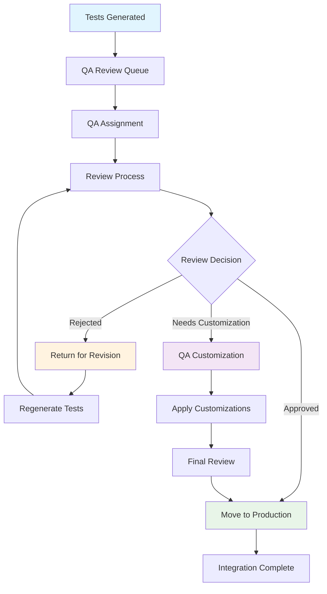

# QA Review Workflow & Integration Points

*Phase 4: Solution Design - QA Integration Specifications*  
*Date: 2025-08-21*

---

## 🔍 QA Review Workflow Architecture

### 1. Review Workflow States

```python
from enum import Enum
from dataclasses import dataclass
from typing import List, Optional
import datetime

class ReviewStatus(Enum):
    PENDING = "pending"           # Generated, awaiting QA review
    IN_REVIEW = "in_review"       # QA is currently reviewing
    APPROVED = "approved"         # QA approved, ready for use
    REJECTED = "rejected"         # QA rejected, needs revision
    CUSTOMIZING = "customizing"   # QA is making customizations
    COMPLETED = "completed"       # Review process finished

@dataclass
class ReviewWorkflow:
    generation_id: str
    status: ReviewStatus
    assigned_qa: Optional[str]
    created_at: datetime.datetime
    review_deadline: datetime.datetime
    priority: str  # "high", "medium", "low"
    
    # Review tracking
    review_started_at: Optional[datetime.datetime] = None
    review_completed_at: Optional[datetime.datetime] = None
    review_comments: List[str] = None
    customization_requests: List[str] = None
    
    # File tracking
    generated_files: List[str] = None
    reviewed_files: List[str] = None
    approved_files: List[str] = None
```

### 2. Review Process Flow



---

## 👥 QA Review Interface System

### 1. Review Dashboard

```python
class QAReviewDashboard:
    def __init__(self, db_connection):
        self.db = db_connection
        
    def get_pending_reviews(self, qa_user: str = None) -> List[ReviewWorkflow]:
        """Get list of test generations awaiting review"""
        query = """
        SELECT * FROM review_workflows 
        WHERE status = 'pending'
        """
        if qa_user:
            query += f" AND (assigned_qa = '{qa_user}' OR assigned_qa IS NULL)"
        query += " ORDER BY priority DESC, created_at ASC"
        
        return self.db.execute(query).fetchall()
    
    def get_review_summary(self, qa_user: str) -> dict:
        """Get QA review workload summary"""
        return {
            "pending_count": self.count_reviews("pending", qa_user),
            "in_review_count": self.count_reviews("in_review", qa_user),  
            "completed_today": self.count_reviews_today("completed", qa_user),
            "average_review_time": self.get_avg_review_time(qa_user),
            "overdue_reviews": self.get_overdue_reviews(qa_user)
        }
```

### 2. Review Interface CLI

```bash
# QA Review Command Line Interface
qa-review --help

Commands:
  qa-review list                    # List pending reviews
  qa-review assign <generation_id>  # Assign review to current QA
  qa-review start <generation_id>   # Start reviewing generation
  qa-review status <generation_id>  # Check review status
  qa-review approve <generation_id> # Approve tests
  qa-review reject <generation_id>  # Reject with comments
  qa-review customize <generation_id> # Enter customization mode

# Usage Examples:
qa-review list --priority high
qa-review start gen_20250821_001 --estimated-time 2h
qa-review approve gen_20250821_001 --comment "All tests look good"
qa-review reject gen_20250821_002 --comment "Missing edge cases for validation"
```

### 3. Review File Organization

```
qa_review/
├── pending/                     # Tests awaiting review
│   └── gen_20250821_001/
│       ├── metadata.json        # Generation metadata
│       ├── review_checklist.md  # QA review checklist
│       ├── generated_tests/     # Original generated tests
│       │   ├── test_users_crud.py
│       │   ├── test_users_validation.py
│       │   └── test_users_performance.py
│       └── api_specification/   # Reference API spec
│           └── users_api.json
├── in_review/                   # Currently being reviewed
│   └── gen_20250821_002/
│       ├── review_notes.md      # QA review notes
│       ├── customizations.yaml  # Requested changes
│       └── [same structure as pending]
├── customizing/                 # QA is making changes
│   └── gen_20250821_003/
│       ├── original/           # Original generated tests
│       ├── modified/           # QA-modified tests
│       └── changes.log         # Change tracking
├── approved/                    # QA approved tests
│   └── gen_20250821_004/
│       ├── approval_report.md  # QA approval summary
│       └── final_tests/        # Ready-to-use tests
└── rejected/                    # Tests needing revision
    └── gen_20250821_005/
        ├── rejection_reasons.md # Why rejected
        └── suggested_fixes.md   # Improvement suggestions
```

---

## 📋 QA Review Checklist System

### 1. Automated Review Checklist

```yaml
# qa_review_checklist.yaml
review_categories:
  technical_quality:
    - test_syntax_valid: "All test files have valid pytest syntax"
    - imports_correct: "All imports are available and correct"
    - fixtures_appropriate: "Test fixtures are properly defined"
    - assertions_meaningful: "Assertions test the right conditions"
    - error_handling: "Error scenarios are properly tested"
    
  business_logic:
    - requirements_coverage: "Tests cover all business requirements"
    - edge_cases_identified: "Important edge cases are tested"
    - data_scenarios: "Test data reflects real-world usage"
    - workflow_accuracy: "Test workflow matches business process"
    
  maintainability:
    - test_readability: "Tests are easy to read and understand"
    - documentation_adequate: "Test purpose is clearly documented"
    - naming_consistent: "Test names follow consistent patterns"
    - code_duplication: "Minimal code duplication between tests"
    
  performance:
    - response_time_realistic: "Performance thresholds are realistic"
    - load_testing_appropriate: "Load test scenarios match expected usage"
    - resource_usage_monitored: "Resource utilization is considered"
    
  security:
    - authentication_tested: "Authentication scenarios are covered"
    - authorization_verified: "Authorization rules are tested"
    - input_sanitization: "Input validation security is tested"
    - data_exposure: "No sensitive data is exposed in tests"

scoring:
  excellent: 90-100  # Auto-approve eligible
  good: 75-89        # Minor customizations may be needed
  acceptable: 60-74  # Requires review and customization
  needs_work: 0-59   # Reject and regenerate
```

### 2. Interactive Review Interface

```python
class InteractiveReviewTool:
    def __init__(self, generation_id: str):
        self.generation_id = generation_id
        self.checklist = self.load_review_checklist()
        self.review_scores = {}
        
    def start_review(self):
        """Start interactive review process"""
        print(f"🔍 Starting review for generation {self.generation_id}")
        print("=" * 60)
        
        for category, items in self.checklist.items():
            print(f"\n📂 {category.upper()}")
            print("-" * 40)
            
            category_score = self.review_category(category, items)
            self.review_scores[category] = category_score
            
        overall_score = self.calculate_overall_score()
        recommendation = self.get_recommendation(overall_score)
        
        self.display_review_summary(overall_score, recommendation)
        return self.finalize_review(recommendation)
    
    def review_category(self, category: str, items: List[dict]) -> int:
        """Review individual category with QA input"""
        scores = []
        
        for item in items:
            print(f"\n✓ {item['description']}")
            
            # Show relevant test files
            relevant_files = self.find_relevant_files(item['criteria'])
            for file_path in relevant_files:
                print(f"   📄 {file_path}")
                
            # Get QA score
            while True:
                try:
                    score = input("   Score (0-10): ").strip()
                    score = int(score)
                    if 0 <= score <= 10:
                        scores.append(score)
                        break
                    else:
                        print("   Please enter a score between 0 and 10")
                except ValueError:
                    print("   Please enter a valid number")
                    
            # Optional comment
            comment = input("   Comment (optional): ").strip()
            if comment:
                self.add_review_comment(category, item['criteria'], comment)
                
        return sum(scores) // len(scores) if scores else 0
```

### 3. Customization Request System

```python
@dataclass
class CustomizationRequest:
    test_file: str
    test_method: str
    customization_type: str  # "modify", "add", "remove", "replace"
    description: str
    current_code: str
    requested_code: str
    justification: str
    priority: str  # "must_have", "should_have", "nice_to_have"

class CustomizationManager:
    def create_customization_request(self, request: CustomizationRequest) -> str:
        """Create customization request for QA team"""
        request_id = f"custom_{int(time.time())}"
        
        # Save customization request
        self.save_customization_request(request_id, request)
        
        # Generate customization script
        script = self.generate_customization_script(request)
        self.save_customization_script(request_id, script)
        
        return request_id
    
    def apply_customizations(self, generation_id: str) -> bool:
        """Apply all approved customizations"""
        customizations = self.get_approved_customizations(generation_id)
        
        for customization in customizations:
            try:
                self.apply_single_customization(customization)
                self.mark_customization_applied(customization.id)
            except Exception as e:
                self.log_customization_error(customization.id, str(e))
                return False
                
        return True
```

---

## 🔧 Integration Points

### 1. Webhook Integration with QA Workflow

```python
class WebhookQAIntegration:
    async def process_generation_complete(self, generation_result: GenerationResult):
        """Handle completed test generation for QA review"""
        
        # Create QA review workflow
        review_workflow = ReviewWorkflow(
            generation_id=generation_result.generation_id,
            status=ReviewStatus.PENDING,
            assigned_qa=self.assign_qa_reviewer(generation_result),
            created_at=datetime.datetime.now(),
            review_deadline=self.calculate_review_deadline(),
            priority=self.determine_priority(generation_result),
            generated_files=generation_result.files_created
        )
        
        # Save to review queue
        await self.save_review_workflow(review_workflow)
        
        # Organize files for review
        await self.organize_review_files(generation_result)
        
        # Notify assigned QA
        await self.notify_qa_reviewer(review_workflow)
        
        # Generate review checklist
        await self.generate_review_checklist(generation_result)
    
    def assign_qa_reviewer(self, generation_result: GenerationResult) -> str:
        """Assign QA reviewer based on workload and expertise"""
        available_qas = self.get_available_qa_reviewers()
        
        # Consider workload balancing
        qa_workloads = {qa: self.get_qa_workload(qa) for qa in available_qas}
        
        # Consider expertise matching
        api_complexity = self.assess_api_complexity(generation_result)
        
        # Assign to QA with lowest workload and appropriate expertise
        best_qa = min(available_qas, key=lambda qa: (
            qa_workloads[qa], 
            -self.get_expertise_score(qa, api_complexity)
        ))
        
        return best_qa
```

### 2. CI/CD Pipeline Integration

```yaml
# .github/workflows/qa-review-integration.yml
name: QA Review Integration

on:
  webhook:
    types: [generation_complete]

jobs:
  setup-qa-review:
    runs-on: ubuntu-latest
    steps:
      - name: Checkout code
        uses: actions/checkout@v2
        
      - name: Setup QA review environment
        run: |
          python -m pip install qa-review-tools
          qa-review setup --generation-id ${{ github.event.generation_id }}
          
      - name: Run automated quality checks
        run: |
          qa-review validate --generation-id ${{ github.event.generation_id }}
          qa-review lint --generation-id ${{ github.event.generation_id }}
          qa-review security-scan --generation-id ${{ github.event.generation_id }}
          
      - name: Create QA review PR
        run: |
          qa-review create-pr --generation-id ${{ github.event.generation_id }}
          
      - name: Notify QA team
        uses: ./.github/actions/notify-qa
        with:
          generation_id: ${{ github.event.generation_id }}
          assigned_qa: ${{ github.event.assigned_qa }}
```

### 3. Test Execution Integration

```python
class TestExecutionIntegration:
    def __init__(self, config: TestConfig):
        self.config = config
        self.pytest_runner = PytestRunner(config)
        
    async def execute_approved_tests(self, generation_id: str) -> TestExecutionResult:
        """Execute QA-approved tests"""
        
        # Get approved test files
        approved_files = self.get_approved_test_files(generation_id)
        
        # Setup test environment
        await self.setup_test_environment()
        
        # Execute tests with reporting
        execution_result = await self.pytest_runner.run_tests(
            test_files=approved_files,
            report_formats=["html", "json", "junit"],
            coverage_enabled=True
        )
        
        # Process results
        await self.process_execution_results(generation_id, execution_result)
        
        # Update QA workflow status
        await self.update_workflow_status(generation_id, ReviewStatus.COMPLETED)
        
        return execution_result
    
    def generate_qa_execution_report(self, generation_id: str) -> str:
        """Generate comprehensive QA execution report"""
        template = self.jinja_env.get_template("qa_execution_report.html")
        
        context = {
            "generation_id": generation_id,
            "execution_results": self.get_execution_results(generation_id),
            "qa_review_summary": self.get_review_summary(generation_id),
            "test_coverage": self.get_test_coverage(generation_id),
            "performance_metrics": self.get_performance_metrics(generation_id)
        }
        
        return template.render(**context)
```

---

## 📊 QA Metrics & Reporting

### 1. QA Performance Metrics

```python
class QAMetricsCollector:
    def collect_review_metrics(self, time_period: str = "last_30_days") -> dict:
        """Collect QA review performance metrics"""
        return {
            "review_throughput": {
                "total_reviews": self.count_completed_reviews(time_period),
                "avg_review_time": self.get_avg_review_time(time_period),
                "reviews_per_qa": self.get_reviews_per_qa(time_period)
            },
            "quality_metrics": {
                "approval_rate": self.calculate_approval_rate(time_period),
                "rejection_rate": self.calculate_rejection_rate(time_period),
                "customization_rate": self.calculate_customization_rate(time_period)
            },
            "efficiency_metrics": {
                "first_time_approval_rate": self.get_first_time_approval_rate(time_period),
                "avg_customizations_per_review": self.get_avg_customizations(time_period),
                "review_backlog": self.get_current_backlog_size()
            },
            "test_quality_metrics": {
                "avg_test_coverage": self.get_avg_test_coverage(time_period),
                "test_execution_success_rate": self.get_test_success_rate(time_period),
                "bugs_found_in_production": self.get_production_bugs(time_period)
            }
        }
```

### 2. Review Quality Dashboard

```html
<!-- QA Review Dashboard Template -->
<div class="qa-dashboard">
    <h2>QA Review Dashboard</h2>
    
    <!-- Current Workload -->
    <div class="workload-section">
        <h3>Current Workload</h3>
        <div class="metrics-grid">
            <div class="metric">
                <span class="metric-value">{{ pending_reviews }}</span>
                <span class="metric-label">Pending Reviews</span>
            </div>
            <div class="metric">
                <span class="metric-value">{{ avg_review_time }}</span>
                <span class="metric-label">Avg Review Time</span>
            </div>
            <div class="metric">
                <span class="metric-value">{{ approval_rate }}%</span>
                <span class="metric-label">Approval Rate</span>
            </div>
        </div>
    </div>
    
    <!-- Review Queue -->
    <div class="review-queue">
        <h3>Review Queue</h3>
        <table class="review-table">
            <thead>
                <tr>
                    <th>Generation ID</th>
                    <th>API</th>
                    <th>Priority</th>
                    <th>Created</th>
                    <th>Deadline</th>
                    <th>Status</th>
                    <th>Actions</th>
                </tr>
            </thead>
            <tbody>
                
                <tr>
                    <td>{{ review.generation_id }}</td>
                    <td>{{ review.api_name }}</td>
                    <td>{{ review.priority }}</td>
                    <td>{{ review.created_at }}</td>
                    <td>{{ review.deadline }}</td>
                    <td>{{ review.status }}</td>
                    <td>
                        <button onclick="startReview('{{ review.generation_id }}')">Start Review</button>
                    </td>
                </tr>
                
            </tbody>
        </table>
    </div>
</div>
```

---

## 🔄 Continuous Improvement Loop

### 1. QA Feedback Integration

```python
class QAFeedbackProcessor:
    def collect_qa_feedback(self, generation_id: str) -> QAFeedback:
        """Collect QA feedback for template improvement"""
        return QAFeedback(
            generation_id=generation_id,
            template_quality_scores=self.get_template_scores(generation_id),
            common_customizations=self.get_common_customizations(generation_id),
            improvement_suggestions=self.get_improvement_suggestions(generation_id),
            time_savings_achieved=self.calculate_time_savings(generation_id)
        )
    
    def analyze_feedback_patterns(self) -> List[str]:
        """Analyze QA feedback to identify improvement opportunities"""
        all_feedback = self.get_all_qa_feedback()
        
        patterns = []
        
        # Identify common customization requests
        common_customizations = self.find_common_patterns(
            [f.common_customizations for f in all_feedback]
        )
        
        for customization in common_customizations:
            if customization.frequency > 0.3:  # 30% of reviews
                patterns.append(f"Consider adding {customization.type} to default templates")
        
        # Identify template quality issues
        low_scoring_templates = self.find_low_scoring_templates(all_feedback)
        for template in low_scoring_templates:
            patterns.append(f"Template {template.name} needs improvement: {template.common_issues}")
            
        return patterns
```

### 2. Template Evolution System

```python
class TemplateEvolutionEngine:
    def evolve_templates_from_feedback(self, feedback_analysis: List[str]):
        """Evolve templates based on QA feedback patterns"""
        
        for pattern in feedback_analysis:
            if "add to default templates" in pattern:
                self.enhance_default_templates(pattern)
            elif "needs improvement" in pattern:
                self.improve_template_quality(pattern)
            elif "common customization" in pattern:
                self.create_template_variant(pattern)
                
    def enhance_default_templates(self, pattern: str):
        """Add commonly requested features to default templates"""
        # Parse pattern to understand what to add
        enhancement = self.parse_enhancement_request(pattern)
        
        # Update relevant templates
        affected_templates = self.find_templates_for_enhancement(enhancement)
        
        for template_path in affected_templates:
            self.update_template_with_enhancement(template_path, enhancement)
            
        # Version templates for rollback if needed
        self.version_template_changes()
```

---

**QA Review Workflow Complete** ✅

<function_calls>
<invoke name="TodoWrite">
<parameter name="todos">[{"content": "Complete Phase 3: Deep Research - Technical requirements analysis for ApiFox webhook automation", "status": "completed"}, {"content": "Develop risk mitigation strategy for critical and high-risk factors", "status": "completed"}, {"content": "Begin Phase 4: Solution Design - Create technical architecture and detailed design specifications", "status": "completed"}, {"content": "Design system architecture with ApiFox webhook integration", "status": "completed"}, {"content": "Design AI-ready architecture with template-based MVP implementation", "status": "completed"}, {"content": "Create detailed API specifications and data flow diagrams", "status": "completed"}, {"content": "Define pytest test generation templates and patterns", "status": "completed"}, {"content": "Design QA review workflow and integration points", "status": "completed"}]