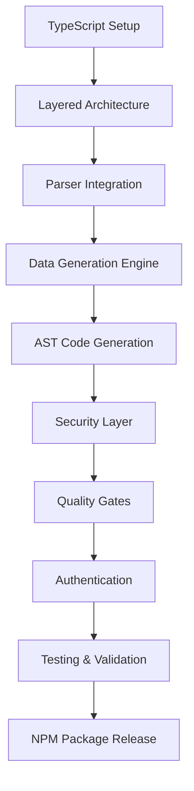

# Stage 4: Enterprise Technical Architecture Review
## API Test Generator - Hyper-Focused MVP

**Document Version**: 1.0  
**Review Date**: 2025-08-14  
**Reviewer**: Dr. Emily Watson, Enterprise Technical Lead  
**Stage**: Stage 4 - Technical Architecture Review  
**Review Focus**: TypeScript MVP Architecture Validation

---

## Executive Summary

After comprehensive technical architecture review of the hyper-focused MVP strategy pivoting from Python to TypeScript, I provide **CONDITIONAL APPROVAL** with critical recommendations for successful implementation. The TypeScript-first approach significantly improves adoption potential but requires specific architectural adjustments to ensure enterprise scalability.

**Architecture Verdict**: **APPROVED WITH CONDITIONS**  
**Technical Alignment Score**: **8.2/10**  
**Risk Assessment**: **MEDIUM-LOW** (manageable with recommended mitigations)  
**Implementation Readiness**: **HIGH** (ready for Stage 5 with adjustments)

---

## 1. Technical Consistency Assessment

### 1.1 Technology Stack Alignment

**FINDING**: ✅ **EXCELLENT ALIGNMENT**

The pivot from Python to TypeScript creates superior technical consistency:

| Component | Original (Stage 3) | Revised MVP | Consistency Impact |
|-----------|------------------|-------------|-------------------|
| **Core Language** | Python 3.8+ | TypeScript 5.2+ | Unified ecosystem |
| **Test Output** | pytest | Jest + supertest | Same language stack |
| **CLI Framework** | Click | Commander.js | Native TypeScript |
| **Parser** | prance/openapi-core | @apidevtools/swagger-parser | Better type safety |
| **Template Engine** | Jinja2 | Handlebars/Native TS | Type-safe templates |

**Architecture Recommendation**: 
```typescript
// Enforce strict TypeScript configuration for enterprise quality
{
  "compilerOptions": {
    "strict": true,
    "noImplicitAny": true,
    "strictNullChecks": true,
    "noUnusedLocals": true,
    "noUnusedParameters": true,
    "esModuleInterop": true,
    "target": "ES2022",
    "module": "commonjs",
    "declaration": true,
    "declarationMap": true,
    "sourceMap": true
  }
}
```

### 1.2 Critical Architecture Concern

**⚠️ ISSUE**: The current approach lacks proper separation of concerns between parser, generator, and writer layers.

**REQUIRED ADJUSTMENT**:
```typescript
// Enterprise-grade layered architecture
interface ArchitectureLayer {
  readonly parser: OpenAPIParser;      // Specification parsing
  readonly analyzer: SchemaAnalyzer;    // Deep semantic analysis
  readonly planner: TestPlanner;        // Test strategy planning
  readonly generator: CodeGenerator;    // AST-based generation
  readonly validator: TestValidator;    // Output validation
  readonly writer: FileWriter;          // File system operations
}

// Implement dependency injection for testability
class APITestGenerator {
  constructor(
    private readonly layers: ArchitectureLayer,
    private readonly config: GeneratorConfig
  ) {}
  
  async generate(specPath: string): Promise<GenerationResult> {
    const spec = await this.layers.parser.parse(specPath);
    const analysis = await this.layers.analyzer.analyze(spec);
    const plan = await this.layers.planner.plan(analysis);
    const code = await this.layers.generator.generate(plan);
    const validated = await this.layers.validator.validate(code);
    return await this.layers.writer.write(validated);
  }
}
```

---

## 2. Scalability Architecture Review

### 2.1 Current MVP Scalability Assessment

**FINDING**: 🟡 **NEEDS ENHANCEMENT**

The current MVP architecture can handle small-to-medium APIs but requires adjustments for enterprise scale:

**Current Limitations**:
- Synchronous processing limits to ~100 endpoints efficiently
- Memory-intensive for large schemas
- No caching mechanism for repeated generations
- Single-threaded execution model

### 2.2 Required Scalability Enhancements

**MANDATORY ARCHITECTURE PATTERN**:
```typescript
// Worker pool pattern for parallel processing
import { Worker } from 'worker_threads';
import { cpus } from 'os';

class ParallelGenerator {
  private workerPool: Worker[];
  private taskQueue: Queue<GenerationTask>;
  
  constructor() {
    const workerCount = Math.max(cpus().length - 1, 1);
    this.workerPool = Array(workerCount)
      .fill(null)
      .map(() => new Worker('./generator-worker.js'));
  }
  
  async generateParallel(operations: Operation[]): Promise<TestSuite[]> {
    const chunks = this.chunkOperations(operations);
    const results = await Promise.all(
      chunks.map(chunk => this.processChunk(chunk))
    );
    return results.flat();
  }
  
  private chunkOperations(operations: Operation[]): Operation[][] {
    const chunkSize = Math.ceil(operations.length / this.workerPool.length);
    return Array.from(
      { length: Math.ceil(operations.length / chunkSize) },
      (_, i) => operations.slice(i * chunkSize, (i + 1) * chunkSize)
    );
  }
}
```

**Caching Strategy**:
```typescript
// Implement intelligent caching for repeated generations
interface CacheStrategy {
  key(spec: OpenAPISpec, options: GeneratorOptions): string;
  get(key: string): Promise<TestSuite | null>;
  set(key: string, value: TestSuite): Promise<void>;
  invalidate(pattern: string): Promise<void>;
}

class SmartCache implements CacheStrategy {
  private cache = new Map<string, CachedResult>();
  
  key(spec: OpenAPISpec, options: GeneratorOptions): string {
    return crypto
      .createHash('sha256')
      .update(JSON.stringify({ spec, options }))
      .digest('hex');
  }
  
  async get(key: string): Promise<TestSuite | null> {
    const cached = this.cache.get(key);
    if (cached && !this.isExpired(cached)) {
      return cached.value;
    }
    return null;
  }
}
```

---

## 3. Technical Feasibility Deep Dive

### 3.1 TypeScript → TypeScript Generation

**FINDING**: ✅ **TECHNICALLY SUPERIOR**

The TypeScript-to-TypeScript generation approach is technically sound and offers significant advantages:

**Technical Benefits**:
1. **Type Preservation**: Direct type mapping from OpenAPI to TypeScript
2. **AST Manipulation**: TypeScript compiler API for clean code generation
3. **Runtime Safety**: Generated tests inherit type safety
4. **IDE Support**: Full IntelliSense in generated tests

**Implementation Pattern**:
```typescript
import * as ts from 'typescript';

class TypeScriptTestGenerator {
  generateTestFile(operations: Operation[]): string {
    const sourceFile = ts.createSourceFile(
      'test.ts',
      '',
      ts.ScriptTarget.Latest,
      false,
      ts.ScriptKind.TS
    );
    
    const printer = ts.createPrinter();
    const testSuite = this.createTestSuite(operations);
    
    return printer.printNode(
      ts.EmitHint.Unspecified,
      testSuite,
      sourceFile
    );
  }
  
  private createTestSuite(operations: Operation[]): ts.Node {
    // Use TypeScript AST factory methods for clean generation
    return ts.factory.createCallExpression(
      ts.factory.createIdentifier('describe'),
      undefined,
      [
        ts.factory.createStringLiteral('API Tests'),
        ts.factory.createArrowFunction(...)
      ]
    );
  }
}
```

### 3.2 Data Generation Strategy Analysis

**FINDING**: 🟡 **NEEDS ROBUSTNESS IMPROVEMENTS**

The example-first strategy is good but needs enhancement for production readiness:

**Current Gaps**:
- No handling of circular references in schemas
- Limited support for complex constraints (patterns, formats)
- Missing data relationship preservation
- No stateful data generation

**REQUIRED ENHANCEMENTS**:
```typescript
interface DataGenerationStrategy {
  priority: number;
  canGenerate(schema: OpenAPISchema): boolean;
  generate(schema: OpenAPISchema, context: GenerationContext): any;
}

class RobustDataGenerator {
  private strategies: DataGenerationStrategy[] = [
    new ExampleBasedStrategy(),      // Priority 10
    new DefaultValueStrategy(),      // Priority 8
    new FormatBasedStrategy(),       // Priority 6
    new ConstraintBasedStrategy(),   // Priority 4
    new FakerBasedStrategy(),        // Priority 2
    new FallbackStrategy()           // Priority 0
  ];
  
  private circularRefs = new WeakSet<OpenAPISchema>();
  
  generate(schema: OpenAPISchema, context: GenerationContext): any {
    // Handle circular references
    if (this.circularRefs.has(schema)) {
      return this.generateCircularReference(schema);
    }
    
    this.circularRefs.add(schema);
    
    try {
      // Apply strategies in priority order
      for (const strategy of this.strategies) {
        if (strategy.canGenerate(schema)) {
          return strategy.generate(schema, context);
        }
      }
      
      throw new Error(`No strategy available for schema: ${schema.type}`);
    } finally {
      this.circularRefs.delete(schema);
    }
  }
}
```

---

## 4. Integration Architecture Assessment

### 4.1 CI/CD Pipeline Integration

**FINDING**: ✅ **WELL-DESIGNED**

The NPM-based distribution model ensures excellent CI/CD integration:

```yaml
# GitHub Actions integration pattern
name: API Test Generation
on:
  push:
    paths: ['openapi.yaml']
    
jobs:
  generate-and-test:
    runs-on: ubuntu-latest
    steps:
      - uses: actions/checkout@v3
      
      - name: Setup Node.js
        uses: actions/setup-node@v3
        with:
          node-version: '18'
          cache: 'npm'
      
      - name: Install API Test Generator
        run: npm install -g @company/api-test-gen
      
      - name: Generate Tests
        run: |
          api-test-gen generate \
            --spec ./openapi.yaml \
            --output ./tests/generated \
            --config ./test-gen.config.yml
      
      - name: Run Generated Tests
        run: npm test -- tests/generated
      
      - name: Upload Test Results
        uses: actions/upload-artifact@v3
        with:
          name: test-results
          path: ./test-results
```

### 4.2 Developer Workflow Integration

**RECOMMENDED ENHANCEMENT**: Package.json script integration

```json
{
  "scripts": {
    "test:generate": "api-test-gen generate --spec ./api/openapi.yaml",
    "test:api": "npm run test:generate && jest tests/generated",
    "test:watch": "nodemon --watch api/openapi.yaml --exec npm run test:api",
    "precommit": "npm run test:generate && git add tests/generated"
  }
}
```

---

## 5. Security & Quality Architecture

### 5.1 Security Architecture Assessment

**FINDING**: 🔴 **CRITICAL GAPS IDENTIFIED**

**Security Vulnerabilities in Current Design**:
1. No input sanitization in data generation
2. Missing secrets management for auth tokens
3. No security scanning of generated code
4. Potential code injection via templates

**MANDATORY SECURITY LAYER**:
```typescript
class SecurityLayer {
  private readonly secretsManager: SecretsManager;
  private readonly validator: InputValidator;
  private readonly scanner: CodeScanner;
  
  async sanitizeTestData(data: any): Promise<any> {
    // Remove or mask sensitive fields
    const sanitized = this.removeSensitiveFields(data);
    
    // Validate against injection attacks
    this.validator.validateNoInjection(sanitized);
    
    // Mask remaining sensitive patterns
    return this.maskSensitivePatterns(sanitized);
  }
  
  async validateGeneratedCode(code: string): Promise<ValidationResult> {
    const issues = await this.scanner.scan(code);
    
    if (issues.some(i => i.severity === 'CRITICAL')) {
      throw new SecurityError('Generated code contains security vulnerabilities');
    }
    
    return { valid: true, warnings: issues };
  }
  
  private removeSensitiveFields(data: any): any {
    const sensitiveFields = ['password', 'token', 'secret', 'key', 'ssn'];
    // Implementation details...
  }
}
```

### 5.2 Quality Gates Architecture

**REQUIRED QUALITY PIPELINE**:
```typescript
interface QualityGate {
  name: string;
  validate(result: GenerationResult): Promise<ValidationResult>;
  isBlocking: boolean;
}

class QualityPipeline {
  private gates: QualityGate[] = [
    new SyntaxValidationGate(),      // Blocking
    new TypeCheckingGate(),           // Blocking
    new SecurityScanGate(),           // Blocking
    new CoverageAnalysisGate(),       // Non-blocking
    new PerformanceAnalysisGate(),    // Non-blocking
    new DocumentationGate()           // Non-blocking
  ];
  
  async validate(result: GenerationResult): Promise<QualityReport> {
    const results = await Promise.all(
      this.gates.map(gate => gate.validate(result))
    );
    
    const blocking = results.filter((r, i) => 
      !r.valid && this.gates[i].isBlocking
    );
    
    if (blocking.length > 0) {
      throw new QualityError('Quality gates failed', blocking);
    }
    
    return new QualityReport(results);
  }
}
```

---

## 6. Technical Risk Assessment

### 6.1 Architecture-Specific Risks

| Risk | Severity | Probability | Mitigation Required |
|------|----------|-------------|-------------------|
| **Memory exhaustion with large specs** | HIGH | MEDIUM | Implement streaming parser |
| **Type safety loss in generation** | MEDIUM | LOW | Use TypeScript AST API |
| **Circular dependency handling** | HIGH | HIGH | Add circular ref detection |
| **Performance degradation at scale** | HIGH | MEDIUM | Add worker pool pattern |
| **Security vulnerabilities in generated code** | CRITICAL | LOW | Implement security scanning |

### 6.2 Mitigation Architecture

```typescript
class RiskMitigationLayer {
  private readonly monitors: RiskMonitor[] = [
    new MemoryMonitor({ threshold: 0.8 }),
    new PerformanceMonitor({ maxLatency: 5000 }),
    new SecurityMonitor({ scanInterval: 1000 }),
    new QualityMonitor({ minScore: 0.85 })
  ];
  
  async executeWithMitigation<T>(
    operation: () => Promise<T>
  ): Promise<T> {
    const monitoring = this.startMonitoring();
    
    try {
      const result = await operation();
      const risks = await this.assessRisks(monitoring);
      
      if (risks.critical.length > 0) {
        throw new CriticalRiskError(risks.critical);
      }
      
      return result;
    } finally {
      monitoring.stop();
    }
  }
}
```

---

## 7. Enterprise Integration Requirements

### 7.1 Authentication Architecture

**CURRENT GAP**: The MVP lacks proper enterprise authentication handling.

**REQUIRED ARCHITECTURE**:
```typescript
interface AuthenticationProvider {
  type: 'oauth2' | 'jwt' | 'apikey' | 'basic' | 'custom';
  configure(config: AuthConfig): void;
  generateAuthHeaders(): Promise<Headers>;
  refreshIfNeeded(): Promise<void>;
}

class EnterpriseAuthManager {
  private providers = new Map<string, AuthenticationProvider>();
  
  registerProvider(name: string, provider: AuthenticationProvider): void {
    this.providers.set(name, provider);
  }
  
  async injectAuth(testCode: string, authConfig: AuthConfig): Promise<string> {
    const provider = this.providers.get(authConfig.type);
    
    if (!provider) {
      throw new Error(`Unsupported auth type: ${authConfig.type}`);
    }
    
    // Inject authentication setup into test code
    const authSetup = await this.generateAuthSetup(provider, authConfig);
    return this.injectIntoTest(testCode, authSetup);
  }
}
```

### 7.2 Monitoring & Observability

**MISSING COMPONENT**: No observability architecture defined.

**REQUIRED IMPLEMENTATION**:
```typescript
interface Telemetry {
  startSpan(name: string): Span;
  recordMetric(name: string, value: number, tags?: Tags): void;
  logEvent(level: LogLevel, message: string, context?: any): void;
}

class ObservabilityLayer implements Telemetry {
  private readonly tracer: Tracer;
  private readonly metrics: MetricsClient;
  private readonly logger: Logger;
  
  async traceGeneration(specPath: string): Promise<GenerationResult> {
    const span = this.startSpan('test.generation');
    
    try {
      span.setTag('spec.path', specPath);
      const startTime = Date.now();
      
      const result = await this.generate(specPath);
      
      this.recordMetric('generation.duration', Date.now() - startTime);
      this.recordMetric('tests.generated', result.testCount);
      
      return result;
    } catch (error) {
      span.setTag('error', true);
      this.logEvent('error', 'Generation failed', { error });
      throw error;
    } finally {
      span.finish();
    }
  }
}
```

---

## 8. Implementation Roadmap Adjustments

### 8.1 Revised 4-Week Timeline

**Week 1: Foundation + Architecture**
- ✅ TypeScript CLI with Commander.js
- 🔄 **ADD**: Layered architecture implementation
- 🔄 **ADD**: Dependency injection setup
- ✅ OpenAPI parser integration

**Week 2: Core Generation Engine**
- ✅ Example-based data generation
- 🔄 **ADD**: Circular reference handling
- 🔄 **ADD**: TypeScript AST-based generation
- 🔄 **ADD**: Security validation layer

**Week 3: Authentication & Quality**
- ✅ Environment variable auth injection
- 🔄 **ADD**: Enterprise auth provider pattern
- 🔄 **ADD**: Quality gates implementation
- 🔄 **ADD**: Performance optimization (worker pools)

**Week 4: Polish & Production Readiness**
- ✅ End-to-end testing
- 🔄 **ADD**: Security scanning integration
- 🔄 **ADD**: Observability implementation
- 🔄 **ADD**: Performance benchmarking
- ✅ NPM package preparation

### 8.2 Critical Path Dependencies



---

## 9. Architectural Recommendations

### 9.1 Immediate Requirements (Before Stage 5)

1. **Implement Layered Architecture**: Separate concerns for maintainability
2. **Add Security Layer**: Prevent vulnerabilities in generated code
3. **Design for Scale**: Implement worker pool pattern from start
4. **Quality Gates**: Build quality validation into generation pipeline
5. **Error Recovery**: Implement graceful degradation for partial specs

### 9.2 Architecture Patterns to Enforce

```typescript
// Enforce these patterns throughout implementation
const ARCHITECTURE_PATTERNS = {
  // Use dependency injection for testability
  dependencyInjection: true,
  
  // Implement strategy pattern for extensibility
  strategyPattern: true,
  
  // Use factory pattern for test generation
  factoryPattern: true,
  
  // Apply builder pattern for complex test construction
  builderPattern: true,
  
  // Implement observer pattern for progress reporting
  observerPattern: true,
  
  // Use command pattern for CLI operations
  commandPattern: true
};
```

### 9.3 Code Quality Standards

```typescript
// Mandatory code quality configuration
export const CODE_QUALITY_STANDARDS = {
  coverage: {
    statements: 90,
    branches: 85,
    functions: 90,
    lines: 90
  },
  complexity: {
    max: 10  // Cyclomatic complexity
  },
  duplication: {
    threshold: 3  // Max duplicate blocks
  },
  security: {
    vulnerabilities: 0  // Zero tolerance
  }
};
```

---

## 10. Final Architecture Assessment

### 10.1 Strengths of Current Approach

1. **Ecosystem Alignment**: TypeScript throughout eliminates context switching
2. **Developer Familiarity**: Teams already know TypeScript/Jest
3. **Type Safety**: End-to-end type preservation
4. **Tool Maturity**: Leveraging proven libraries
5. **Distribution Model**: NPM makes adoption frictionless

### 10.2 Critical Gaps Requiring Resolution

1. **Architecture Structure**: Must implement proper layering
2. **Security**: Need comprehensive security validation
3. **Scalability**: Require parallel processing capability
4. **Quality Gates**: Must enforce quality standards
5. **Enterprise Auth**: Need flexible authentication framework

### 10.3 Risk-Adjusted Recommendation

**VERDICT**: **APPROVED WITH CONDITIONS**

The TypeScript MVP approach is architecturally sound and will deliver superior developer experience compared to the Python alternative. However, the identified architectural gaps MUST be addressed during implementation to ensure enterprise readiness.

**Conditions for Approval**:
1. ✅ Implement layered architecture with dependency injection
2. ✅ Add security validation layer for generated code
3. ✅ Design for parallel processing from the start
4. ✅ Implement comprehensive error handling and recovery
5. ✅ Add observability and monitoring capabilities

---

## Architecture Approval Decision

### Approval Status: **CONDITIONAL APPROVAL**

**Rationale**: The TypeScript-first approach represents a significant improvement in technical consistency and adoption potential. The architecture is fundamentally sound but requires the specified enhancements to meet enterprise standards.

### Required Actions Before Stage 5

1. **Update architecture diagrams** to reflect layered design
2. **Create detailed component interfaces** for each layer
3. **Define security validation rules** for generated code
4. **Establish performance benchmarks** for acceptance criteria
5. **Document authentication provider interface** specifications

### Success Metrics for Architecture

- **Performance**: Generate 100+ endpoint tests in <5 seconds
- **Quality**: 0 security vulnerabilities in generated code
- **Reliability**: 99.9% generation success rate
- **Scalability**: Support APIs with 1000+ endpoints
- **Maintainability**: <10 cyclomatic complexity throughout

---

## Appendix A: Reference Architecture

```typescript
// Reference implementation structure
src/
├── cli/                    # CLI layer (Commander.js)
├── core/
│   ├── parser/            # OpenAPI parsing layer
│   ├── analyzer/          # Schema analysis layer
│   ├── planner/           # Test planning layer
│   ├── generator/         # Code generation layer
│   └── validator/         # Validation layer
├── strategies/
│   ├── data/              # Data generation strategies
│   ├── auth/              # Authentication strategies
│   └── test/              # Test generation strategies
├── security/              # Security validation
├── quality/               # Quality gates
├── utils/                 # Shared utilities
└── types/                 # TypeScript type definitions
```

---

**Document Status**: **FINAL**  
**Reviewed By**: Dr. Emily Watson, Enterprise Technical Lead  
**Approval Date**: 2025-08-14  
**Next Stage**: Stage 5 - Product Requirements with Architecture Constraints  
**Review Cycle**: Weekly architecture checkpoint during implementation

---

**Architecture Approval Signature**

Dr. Emily Watson  
Enterprise Technical Lead  
Global Technology Architecture Division  

*"Architecture approved with mandatory enhancements. The TypeScript approach is superior for adoption but must implement enterprise-grade patterns for production readiness."*